# 7. LLM

## 7.1 LLM이란?

**LLM**은 쉽게 말해 자연어(사람의 언어)로 사람과 대화할 수 있는 계산 요원 같은 것이다. LLM은 단어 시퀀스에 확률을 할당하고, 가능한 다음 단어를 샘플링하여 텍스트를 생성하며 다음 단어를 맞추는 법을 배우며 훈련된다. 
LLM은 세상의 지식이 들어 있는 수많은 텍스트 데이터를 미리 학습(Pretraining)한다. 

 

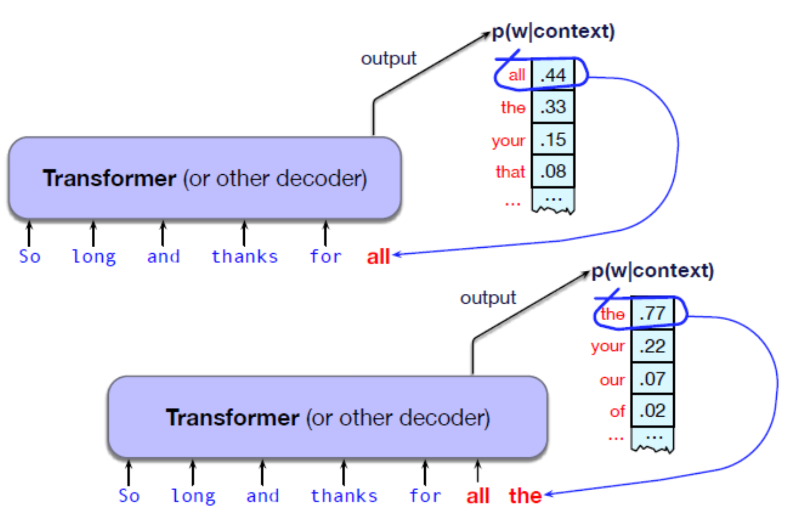 
LLM은 Transformer 신경망 구조를 기반으로 만들어졌다.

- 입력: "So long and thanks for" 같은 문맥(단어들)을 입력받는다.
- 예측: 모델은 이다음에 올 단어들의 확률을 계산한다. (예: 'all' 44%, 'the' 33%, 'your' 15%...) 
- 생성: 이 확률을 바탕으로 하나의 단어(예: 'all')를 선택한다.
- 반복: 이제 "So long and thanks for all"을 새로운 입력으로 삼아 그다음 단어(예: 'the')를 예측하고 선택한다. 이 과정을 반복하며 문장을 생성한다.

 

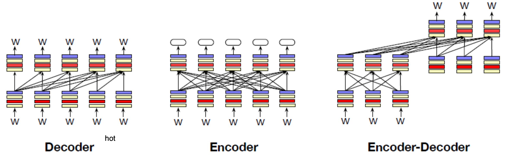 
LLM은 크게 3가지 구조로 나뉜다.

1. Decoder-only
    - 우리가 흔히 생각하는 LLM, 왼쪽에서 오른쪽으로 순차적으로 단어를 예측하고 생성한다. (예: "나는 밥을" -> "먹는다")
    - 예시: GPT, Llama, Claude 
2. Encoder-only
    - 문장 중간의 빈칸(마스크)을 맞히는 훈련을 한다. (예: "나는 [빈칸] 먹는다") 양쪽 문맥을 다 보기 때문에 문장 분류 같은 작업에 주로 쓰인다.
    - 예시: BERT 
3. Encoder-Decoder
    - 하나의 시퀀스(문장)를 다른 시퀀스로 매핑(변환)하는 데 특화되어 있다. 기계 번역이나 음성 인식에 좋다.
    - 예시: T5, Whisper (음성 인식) 

 
 

## 7.2 Prompt

LLM의 핵심 아이디어는 모든 작업을 **단어 예측 문제**로 바꾼다는 것이다. 
LLM에게 입력 텍스트와 프롬프트를 제공하고, 이전 문맥에 따른 다음 토큰 $w_i$의 확률을 계산한다. 
예를 들어, 감성 분석을 할 때 "문장 'I like Jackie Chan'의 감성은:"이라는 텍스트를 주고, 모델이 'positive'를 예측할 확률과 'negative'를 예측할 확률 중 어느 것이 더 높은지 확인하는 것이다. 
이렇게 LLM이 특정 작업을 하도록 유도하는 입력 텍스트를 **프롬프트**라고 부른다. 그리고 효과적인 프롬프트를 찾는 과정을 '프롬프트 엔지니어링'이라고 한다.  

 

프롬프트가 모델을 학습시키지는 않는다. 왜냐하면 training이면 모델의 weight 업데이트가 있어야 하는데, 프롬프트는 weight을 바꾸지는 않는다. 프롬프트에 따라 attention이 변하는 것은 맞으므로 학습 “효과”는 있을 수 있다. 
few-shot learning은 모델이 pre-training이 되어 있다면 적은 사례만 학습시켜서 weight을 업데이트해서 fine-tuning하는 것을 말한다. 따라서 0-shot learning은 일종의 prompt 사용이라고도 할 수 있다. 

 

In-context learning: 프롬프트에 몇 가지 예시(demonstrations)를 넣어주면, LLM이 그 패턴을 학습해서 더 잘 대답한다. 이때 모델의 가중치(파라미터)가 변하는 것이 아니라, 입력되는 문맥(context)만 바뀐다. 즉, 학습이라기보단 임시 힌트를 주는 것에 가깝다.  
LLM에게는 보통 사용자가 모르는 숨겨진 시스템 프롬프트가 있다.(예: "당신은 친절하고 지식이 많은 비서입니다...") 이는 모델의 기본적인 톤과 역할을 설정한다. 

 
 

## 7.3 Decoder-only LLM

모델이 다음 단어 확률을 계산했을 때, 이 중에서 어떤 단어를 최종 선택할지 정하는 과정을 __디코딩(Decoding)__ 이라고 한다.  
 

### 7.3.1. Greedy Decoding

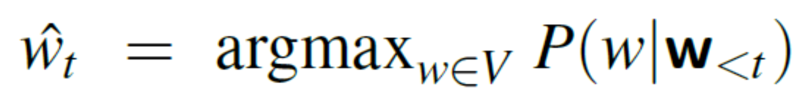 
무조건 확률이 가장 높은 단어만 선택한다. 
항상 가장 예측 가능한 단어만 고르기 때문에, 결과물이 매우 지루하고 반복적이므로 사용하지 않는다. 
 

### 7.3.2. Random Sampling

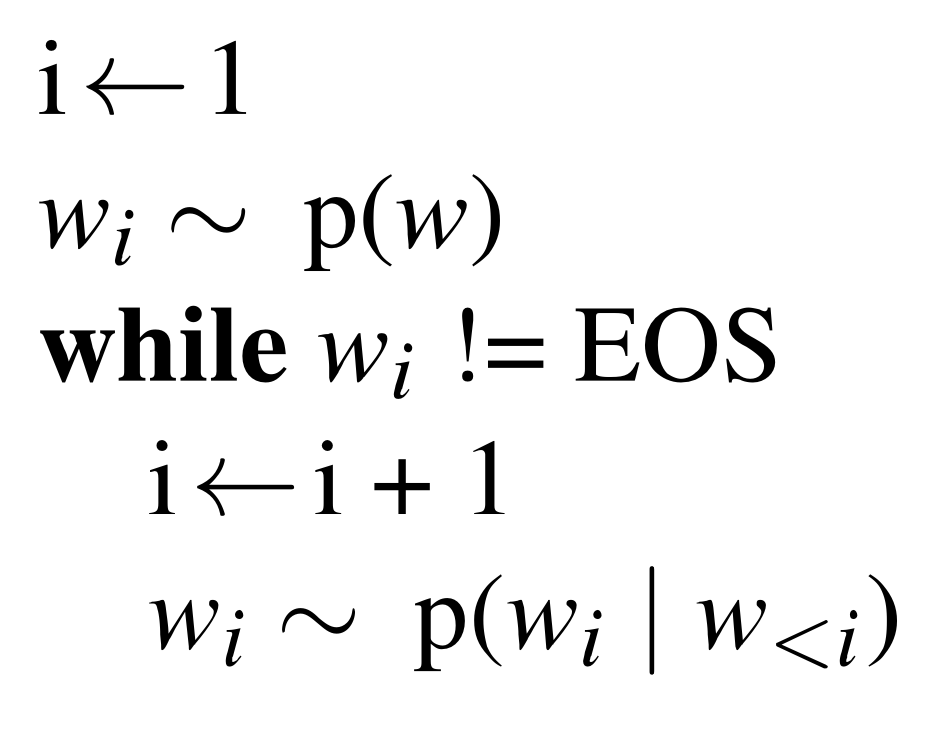 
확률에 따라 무작위로 단어를 뽑는다. (예: 44% 확률로 'all', 33% 확률로 'the'...)  
가끔 확률이 매우 낮지만 이상한 단어가 뽑힐 수 있다.  
 

### 7.3.3. Temperature Sampling

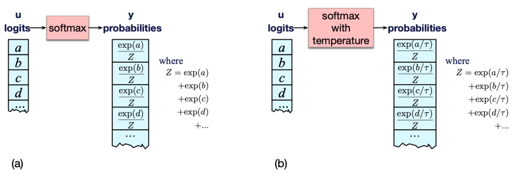 
 
확률 분포를 살짝 '변형'해서 샘플링한다. '온도(temperature, $\tau$)' 값을 조절한다. 
 

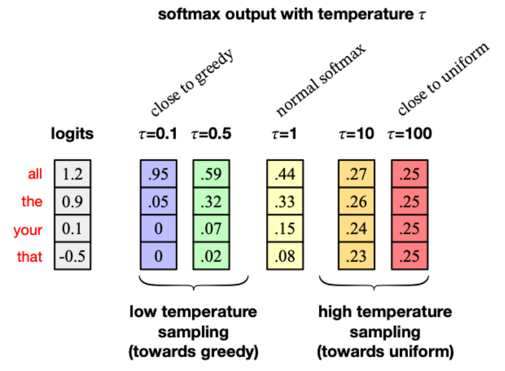 

- 낮은 온도 ($\tau < 1$): 확률이 높은 단어는 더 높게, 낮은 단어는 더 낮게 만든다. 그리디 디코딩에 가까워져서, 더 정확하고 사실적인 답변이 나온다.
- 높은 온도 ($\tau > 1$): 모든 단어의 확률을 비슷하게 만든다. 확률이 낮은 단어도 잘 뽑히게 되어, 더 창의적이고 다양한 답변이 나온다.

 
 

## 7.4 LLM 학습 방식

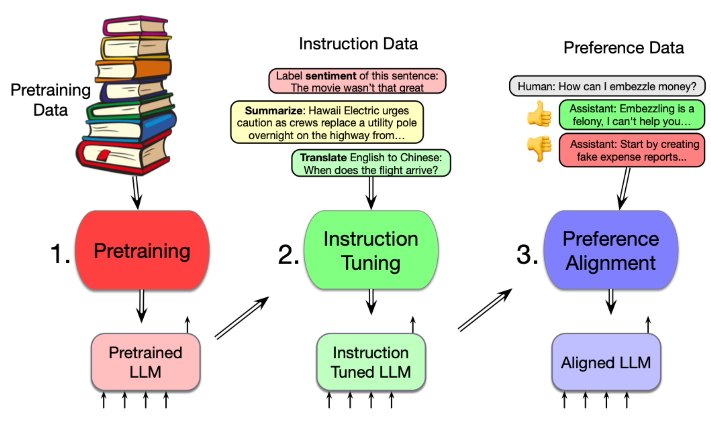  

LLM은 보통 3단계를 거쳐 훈련된다. 

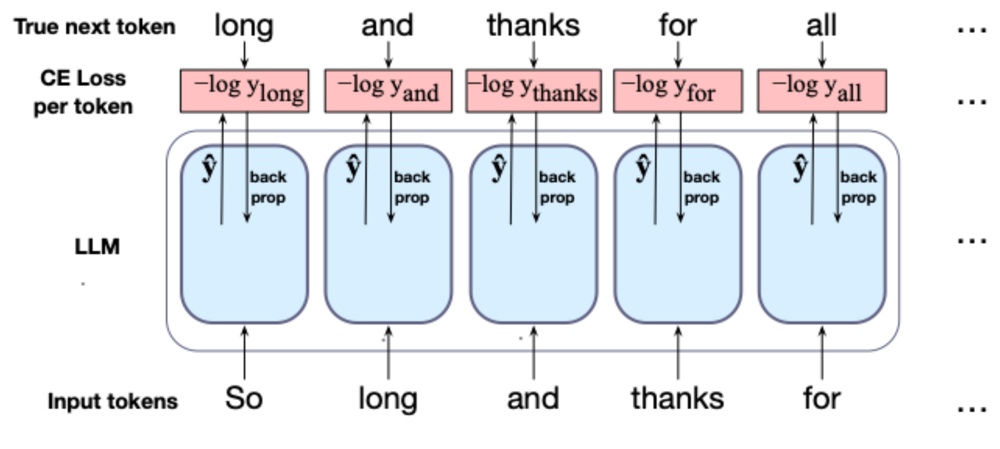 

1. 사전훈련 (Pretraining)
    - 방대한 텍스트 데이터(주로 웹)를 이용해 다음 단어 맞히기 훈련을 한다.
    - 정답(label)이 이미 텍스트의 다음 단어로 정해져 있기 때문에 '자가 지도 학습(Self-supervised)'이라고 부른다.
    - 손실 함수로는 Cross-entropy loss를 사용한다. 모델이 실제 정답 단어에 낮은 확률을 부여하면 큰 loss를 주는 방식이다.
    - 훈련 데이터로는 웹 스크랩 데이터, 책, 코드, 논문 등이 사용된다.
    - 웹 데이터를 그냥 쓰면 저작권 침해, 개인정보 유출, 특정 문화권(주로 미국)에 편중되는 편향성 등의 문제가 발생할 수 있다.
2. 명령어 튜닝 (Instruction Tuning) 
3. 정렬 (Alignment) 

 
 

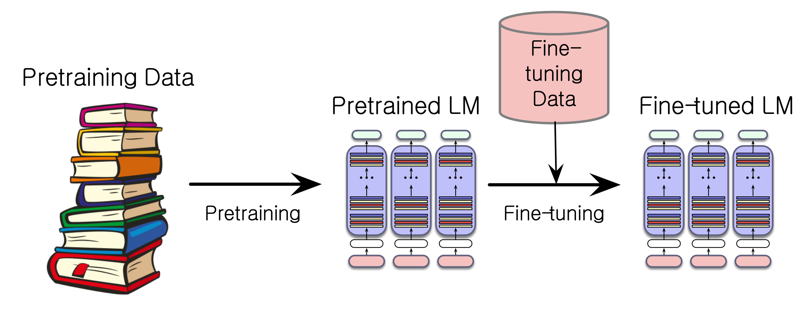  

Finetuning: 사전훈련된 LLM을 특정 도메인(예: 의료, 법률) 이나 특정 언어 데이터로 추가 훈련하는 것을 말힌다. '지속적인 사전훈련(continued pretraining)'이라고도 부른다.  

 
 

## 7.5 LLM 평가

### 7.5.1 log-likelihood

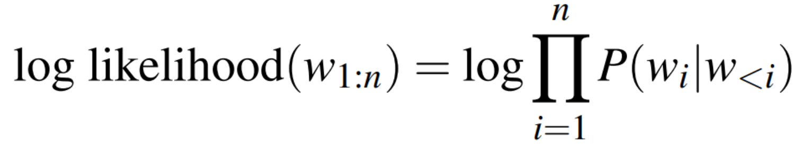 

좋은 LLM은 새로운 텍스트가 주어졌을 때, 그 텍스트의 단어들을 더 정확하게 예측한다.
두 개의 LLM이 있을 때, log likelihood라는 총 확률 값을 비교해서 더 높은 확률을 부여하는 모델이 더 좋다고 볼 수 있다.
하지만 확률값은 테스트하는 텍스트의 길이에 따라 달라지고, 텍스트가 길어질수록 확률은 점점 더 작아진다.(0보다 작은 확률을 계속 곱하기 때문)
이 방식으로는 긴 문장을 평가한 점수와 짧은 문장을 평가한 점수를 공평하게 비교할 수 없다.

 
 

### 7.5.2 Perplexity

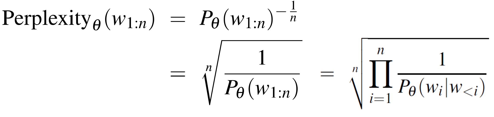 

모델이 테스트용 문장을 보고 얼마나 당황했는가를 측정하는 지표이다. 모델이 예측한 확률의 역수를 정규화한 값이다.  
PPL이 낮을수록 모델이 텍스트를 더 잘 예측한다는 뜻이며, 더 좋은 모델이다.  

 

그 외에도 모델의 크기, 에너지 사용량, 공정성 등으로 모델을 평가할 수 있다.  

 
 

## 7.6 LLM의 문제점

- 환각(Hallucination): 챗봇이 그럴듯한 거짓말이나 사실이 아닌 정보를 만들어내는 현상이다.
- 개인정보: 훈련 데이터에 있던 개인 이메일 주소 등을 유출할 수 있다.
- 독성 및 편향: 사용자에게 위협적인 말을 하거나 , 유해한 내용을 생성할 수 있다.

그 외 Harm (suggesting dangerous actions), Fraud, Emotional dependence, Bias등 다양한 문제점이 제기되고 있다.