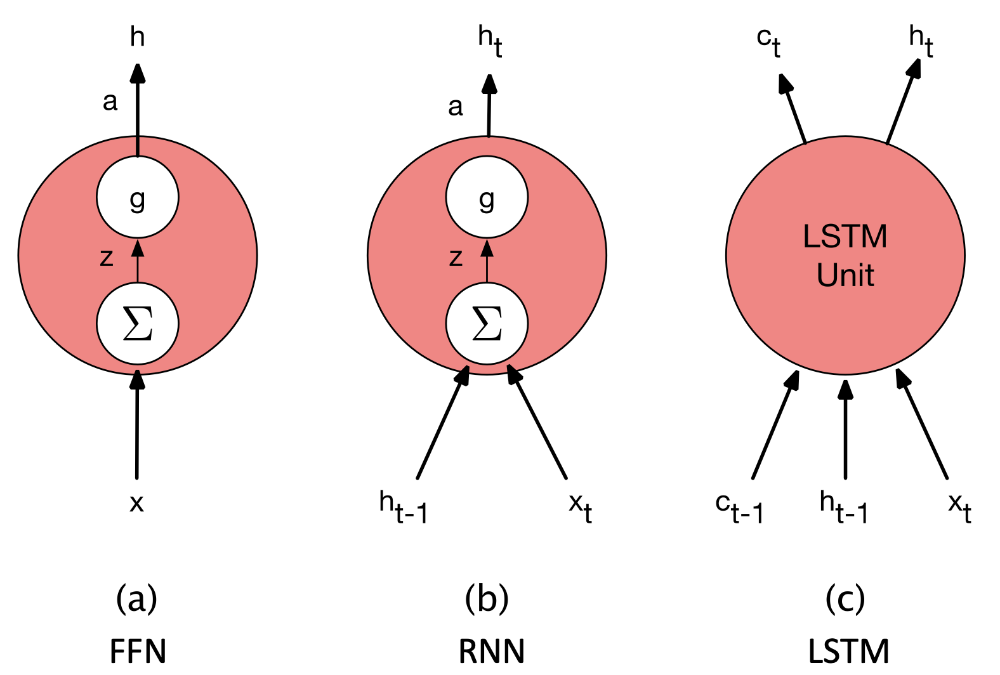
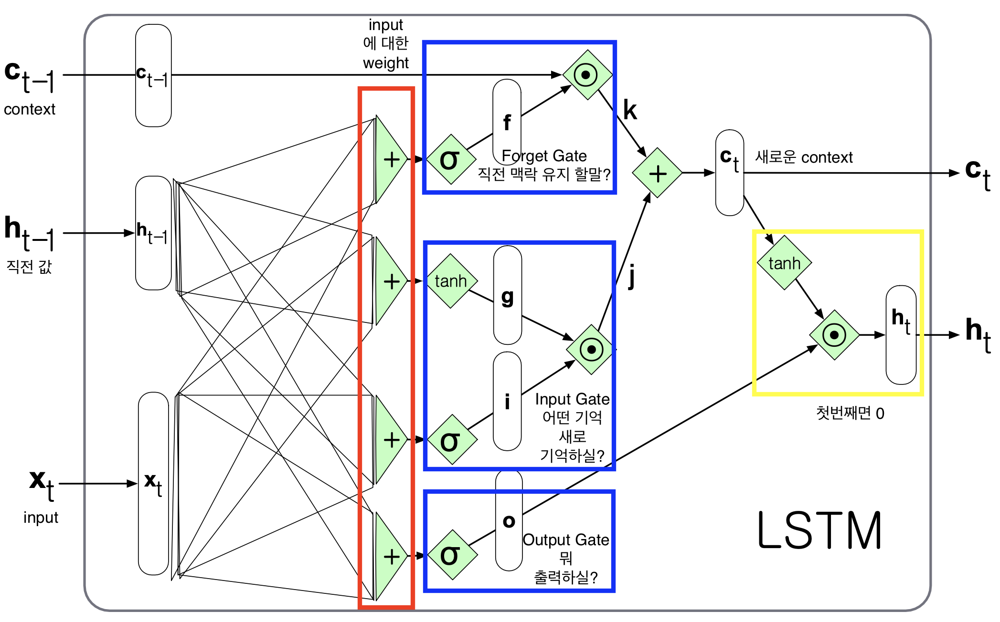
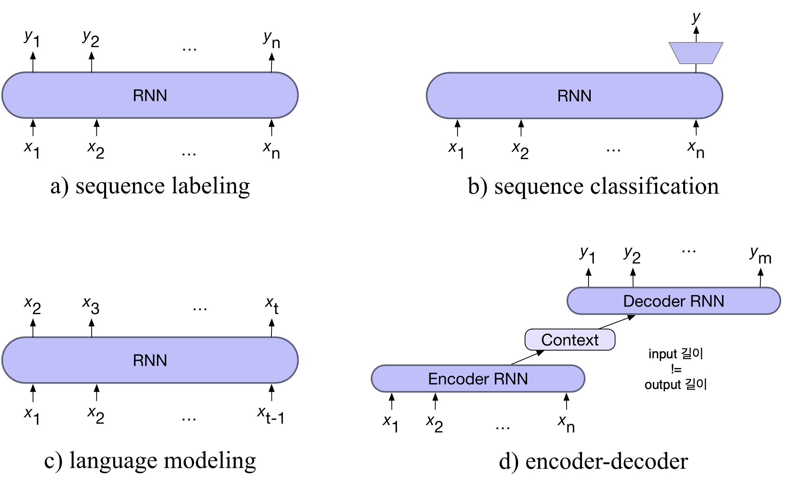
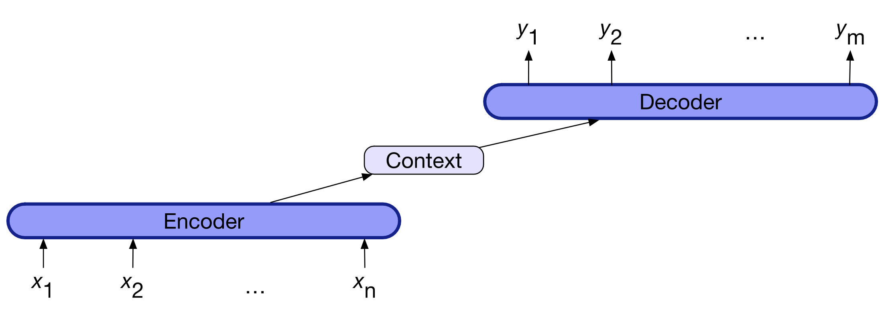
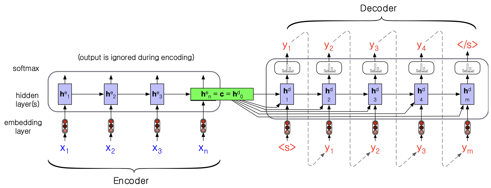
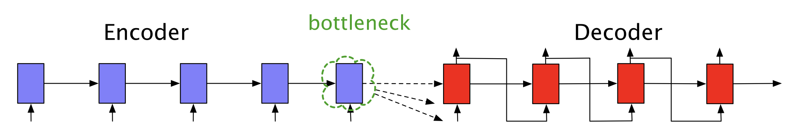
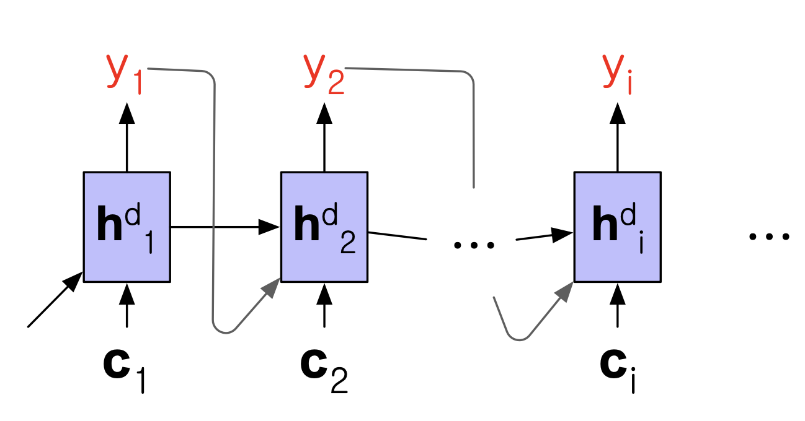
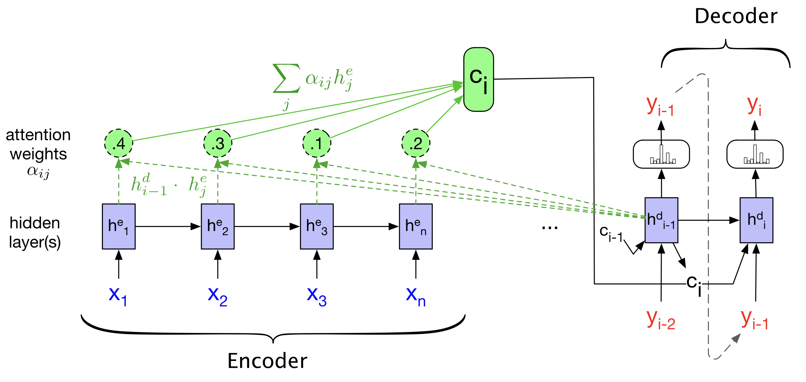

# 4. LSTM

## 4.1 RNN의 한계

RNN의 __기억력($h_t$)__ 이 좋지 않아 문장이 길어지면 앞에 나왔던 중요한 정보를 잊어버리기 쉽다. 
또한 RNN의 은닉 상태($h_t$)는 현재 단어를 예측하는 데 필요한 정보를 제공하고, 미래를 위해 과거의 중요 정보를 계속 전달하는 두 가지 일을 동시에 하느라 너무 바쁘다. 
"The flights the airline was canceling were full"이라는 문장에서 were(복수형)를 쓰려면 주어 "flights"(복수)를 기억해야 하는데, 정보 전달에 실패하는 문제가 발생할 수 있다. 
 

RNN(Recurrent Neural Network) 의 가장 큰 한계 중 하나는 기울기 소실(Vanishing Gradient) 문제이다. 
RNN을 학습시키는 핵심 알고리즘은 BPTT(Backpropagation Through Time) 이며, 이는 시간 축을 따라 펼쳐진 신경망에서 오차를 역전파(backpropagate) 하며 가중치를 학습하는 방식이다. 
이 과정에서 손실 함수를 최소화하기 위해 각 시점의 가중치에 대한 기울기(gradient) 를 계산하고 이를 연쇄적으로 곱하게 된다. 
그런데 만약 이때의 기울기 값이 1보다 작은 수(예: 0.5) 라면 여러 시점을 거치며 계속 곱해질수록 값이 점점 작아져 결국 0에 수렴하게 된다. 
이 현상이 바로 __기울기 소실(Vanishing Gradient)__ 문제이다. 
이 문제를 해결하기 위한 임시방편으로 일정 시점 이전까지의 과거만 가는 TBPTT(Truncated BPTT)도 있다. 
 

## 4.2 LSTM의 등장

### 4.2.1 LSTM이란?

단순 RNN은 '기억'($h_t$)이 하나뿐이라서, "현재 예측"과 "미래를 위한 정보 전달"이라는 두 가지 일을 동시에 하다가 장기 기억을 잊어버린다.
이 문제를 해결하기 위해 __LSTM(Long Short-Term Memory, 장단기 기억)__ 이 등장했다.

LSTM은 '기억 관리' 문제를 두 가지 작은 문제로 나눈다.
- 정보 제거: 더 이상 필요 없는 정보(예: 지나간 문장의 주어)는 문맥에서 지운다.
- 정보 추가: 나중에 필요할 것 같은 중요한 정보(예: "flights"가 복수라는 사실)는 문맥에 추가한다.

이 두 가지 일을 하기 위해 LSTM은 두 개의 새로운 구조를 도입한다.
- 명시적인 문맥 레이어 (Explicit context layer): 셀 상태(Cell State), 장기 기억 전용 고속도로 역할
- 게이트 (Gates): 고속도로로 들어오고 나가는 정보의 흐름을 제어하는 3개의 문(Gate)
 

 

FFN, RNN, LSTM의 유닛을 비교해보자.
- FFN: 입력($x$)을 받아 출력($h$)을 만든다.
- RNN: '시간'의 개념이 도입됩되어 현재 입력($x_t$)과 이전 단계의 기억($h_{t-1}$)을 함께 받아 현재 기억($h_t$)을 만든다. 이때 '기억' 라인이 하나이다.
- LSTM 유닛
    - 입력 (3개): 현재 입력($x_t$), 이전 단계의 단기 기억($h_{t-1}$), 이전 단계의 장기 기억($c_{t-1}$)
    - 출력 (2개): 현재의 단기 기억($h_t$), 현재의 장기 기억($c_t$) 

 

 
위의 이미지는 LSTM의 회로도이다. 각 내용은 다음과 같다.
1. 입력: 왼쪽에서 $c_{t-1}$(맥락), $h_{t-1}$(직전 값), $x_t$(input)이 들어온다.
2. 게이트 계산: 
    - $f$ (Forget Gate): '망각 게이트'. 어떤 정보를 버릴지 결정
    - $i$ (Input Gate): '입력 게이트'. 어떤 정보를 업데이트할지 결정
    - $g$ (Candidate): '입력 게이트'. tanh을 통해 새로운 후보 기억을 생성
    - $o$ (Output Gate): '출력 게이트'. $\sigma$를 통과
3. 장기 기억 업데이트: 
    - 이전 장기 기억($c_{t-1}$)이 망각 게이트($f$)와 만나 "얼마나 잊을지"가 결정된다 ($k$).
    - 새 후보 기억($g$)이 입력 게이트($i$)와 만나 "얼마나 새로 쓸지"가 결정된다 ($j$).
    - 이 둘을 더해서($j+k$) 새로운 장기 기억($c_t$)이 완성됩니다.
4. 단기 기억 출력: 새 장기 기억($c_t$)이 tanh를 통과해 값이 조절되고, 출력 게이트($o$)와 만나 "얼마나 내보낼지"가 결정된다. 이것이 최종적인 단기 기억($h_t$)이 되어 출력된다.

 

$\sigma$ 함수와 $tahn$ 함수 모두 활성화 함수이다. 
$\sigma$ 의 경우, 출력 범위가 0~1이므로 필터 혹은 스위치 역할을 해 정보의 양을 조절한다. 
$tahn$의 경우, 출력 범위가 -1~1이므로 기억 공간(cell state)에 추가될 실질적인 내용을 나타낸다. 양수 값에 가까울수록 정보를 강하게 남기고, 음수 값에 가까울수록 정보를 약화시킨다. 

 

### 4.2.2 Forget Gate

Forget Gate는 더 이상 필요하지 않은 정보를 맥락(기억)에서 삭제하는 게이트이다.
1. 이전 단계의 출력($h_{t-1}$)과 현재 들어온 입력($x_t$)을 받아서 $\sigma$ 계산을 해 0과 1 사이의 값을 가진 '망각 벡터'($f_t$)를 만든다.
2. 여기서 1에 가까운 값은 "정보를 유지하라"는 의미이고, 0에 가까운 값은 "정보를 잊어버려라"는 의미이다.
3. 망각 벡터를 이전 단계의 기억($c_{t-1}$)과 아다마르 곱을 하여 불필요한 정보를 지운 중간 결과물($k$)을 만든다.

### 4.2.3 Add Gate

현재의 입력($x_t$)에서 어떤 새로운 정보를 기억할지 결정하는 게이트이다.
1. 현재 입력($x_t$)과 이전 출력($h_{t-1}$)을 바탕으로 기억에 추가할 만한 새로운 '후보 정보'($g_t$)를 만든다.
2. 추가 게이트($i_t$)는 후보 정보($g_t$) 중에서 어떤 값을 실제로 업데이트할지 결정하는 필터 역할을 한다.
3. 필터링된 새로운 정보($j_t$)를 망각 게이트를 거친 기존 정보($k_t$)에 더하여, 현재 시점의 새로운 기억($c_t$)을 완성한다.

## 4.2.4 Output Gate

업데이트된 기억($c_t$)을 바탕으로 현재 시점에서 어떤 결과($h_t$)를 내보낼지 결정하는 게이트이다. 
미래를 위해 저장할 정보가 아닌, 현재의 숨겨진 상태(hidden state)에 필요한 정보가 무엇인지 결정하는 것이다. 
출력 게이트($o_t$)는 업데이트된 기억($c_t$) 중에서 어떤 부분을 밖으로 내보낼지를 정하는 필터이다. 
이 필터를 거쳐 최종적으로 나온 결과가 현재 시점의 출력인 $h_t$가 됩니다10. 이 $h_t$는 다음 단계로 전달될 뿐만 아니라, 특정 작업을 예측하는 데 사용된다. 

 

## 4.3 encoder-decoder

 
RNN을 이용해 자연어 처리를 하는 구조로는 sequence labeling(품사 태그), sequence classification(문장 긍정/부정 분류), language modeling, encoder-decoder 구조가 있다. 
이 중 이전에 살펴보지 않은 encoder-decoder 구조에 대해 집중적으로 살펴보자. 

 

 
encoder-decoder 구조는 기계 번역처럼 하나의 시퀀스(입력)를 다른 시퀀스(출력)로 변환하는 작업(Sequence-to-Sequence, Seq2Seq)에 사용된다. 조금 더 자세한 구조를 살펴보자.   

  
텍스트를 생성하는 encoder-decoder이며, 구조는 다음과 같다. 

1. 인코더 (Encoder)
    - 역할: 입력 시퀀스 $x_{1:n}$를 받음
    - 기능: 문장을 순서대로 읽으면서, 각 단어의 문맥적 의미를 담고 있는 문맥화된 표현 $h_{1:n}$의 시퀀스 생성
    - 문장 전체의 의미를 압축하여 담아내는 역할
2. 문맥 벡터 $c$ (Context Vector)
    - 역할: 인코더가 생성한 모든 표현 $h_{1:n}$의 함수, 입력의 핵심을 디코더에게 전달
    - 기능: 인코더와 디코더를 연결하는 중간 요약 벡터 역할
    - 인코더가 이해한 내용의 가장 중요한 요약본을 디코더에게 건네주어 작업의 주제나 상황을 알려줌
3. 디코더 (Decoder)
    - 역할: 문맥 벡터 $c$를 입력으로 받음.
    - 기능: 문맥 벡터를 바탕으로 은닉 상태 $h_{1:m}$의 시퀀스를 생성하고, 최종 출력 시퀀스 $y_{1:m}$를 만들어냄. 출력 시퀀스의 길이는 임의의 길이
    - 인코더로부터 받은 요약본 $c$를 참고하여, 실제 결과물(번역 문장 등)을 한 단어씩 만들어냄

인코더는 입력 문장의 모든 정보를 담고 있는 문맥 벡터 $c$를 생성하고, 문맥 벡터는 디코더의 초기 상태로 전달되어 디코딩을 위한 조건(맥락)을 제공하며, 인코더가 전달한 문맥 벡터 $c$를 참고하여 출력 시퀀스를 생성한다. 
인코더-디코더 모델을 훈련할 때, 디코더가 다음 단어를 예측하기 위해 자신이 직전에 예측한 단어 대신 실제 정답(Ground Truth) 단어를 입력으로 사용하는 **Teacher Forcing** 방식을 사용하는 것이 권장된다. 

 

## 4.4 Encoder-decoder equations

### 4.4.1 문맥 벡터 $c$ 정의

$\mathbf{c} = \mathbf{h}_{n}^{e}$  

- $\mathbf{c}$: 문맥 벡터, 입력 문장 전체의 요약본
- $\mathbf{h}_{n}^{e}$: 인코더(Encoder)가 입력 문장의 마지막 단어($n$)를 처리한 후의 은닉 상태

따라서 해당 공식은 인코더의 실행이 완료된 후 가장 마지막 은닉 상태를 문맥 벡터에 저장하는 것이다.

### 4.4.2 디코더의 초기 은닉 상태 설정

$\mathbf{h}_{0}^{d} = \mathbf{c}$  

$\mathbf{h}_{0}^{d}$는 디코더가 시작할 때의 초기 은닉 상태이다. 인코더가 전달한 문맥 벡터 $c$가 디코더의 첫 시작을 결정한다.

### 4.4.3 각 시점($t$)에서의 디코더 상태 갱신

$\mathbf{h}_{t}^{d} = g(\tilde{\mathbf{y}}_{t-1}, \mathbf{h}_{t-1}^{d}, \mathbf{c})$  

- $\mathbf{h}_{t}^{d}$: 현재 시점($t$)의 디코더 은닉 상태
- $g$: RNN 또는 LSTM과 같은 순환 신경망 함수
- $\tilde{\mathbf{y}}_{t-1}$: 직전 시점($t-1$)에 디코더가 출력했던 단어의 임베딩 값
- $\mathbf{h}_{t-1}^{d}$: 직전 시점($t-1$)의 디코더 은닉 상태

디코더가 (이전 시점의 출력 단어), (이전 시점의 상태), 그리고 (입력 문장의 전체 문맥)을 모두 고려하여 다음 상태를 결정한다.

### 4.4.4 최종 출력 단어 확률 계산

$\hat{\mathbf{y}}_{t} = \text{softmax}(\mathbf{h}_{t}^{d})$  

현재 시점($t$)에서 각 단어가 나올 확률은 디코더 은닉 상태에 softmax 함수를 통해 확률로 나타낸 값인 $\hat{\mathbf{y}}_{t}$ 이다.  

 

## 4.5 Bottleneck Problem

 

인코더는 입력 문장 $\mathbf{x}$의 모든 정보(단어 $x_1$부터 $x_n$까지)를 단 하나의 고정된 크기 벡터 $\mathbf{c}$에 압축하여 담는다. 
문장이 길어질수록 문장의 앞부분에 있던 중요한 정보가 문맥 $\mathbf{c}$에 제대로 압축되지 못하고 소실될 가능성이 커지고, 이로 인해 번역이나 요약 같은 긴 시퀀스 작업에서 모델의 성능이 급격히 떨어지게 된다. 

 

## 4.6 어텐션(Attention) 메커니즘

$\mathbf{c}_i = f(\mathbf{h}_{1}^{e}, \dots, \mathbf{h}_{n}^{e}, \mathbf{h}_{i-1}^{d})$  
문맥 벡터 $\mathbf{c}_i$를 인코더의 모든 은닉 상태($\mathbf{h}_{1}^{e}, ... \mathbf{h}_{n}^{e}$)들의 가중 평균으로 계산하는 방식이다.

 

$\mathbf{h}_i^{d} = g(\hat{\mathbf{y}}_{i-1}, \mathbf{h}_{i-1}^{d}, \mathbf{c}_i)$  
현재 시점의 디코더 은닉 상태($\mathbf{h}_i^{d}$)는 이전 출력 단어의 임베딩($\hat{\mathbf{y}}_{i-1}$), 이전 시점의 디코더 은닉 상태($\mathbf{h}_{i-1}^{d}$), $i$ 시점의 문맥 벡터($\mathbf{c}_i$)를 순환 신경망이 연산하여 만들어진다. 

 

## 4.6.1 Score

$score(h_{i-1}^d,h_j^e)=h_{i-1}^d \cdot h_j^e$  
디코더의 이전 상태 $\mathbf{h}_{i-1}^d$와 인코더의 모든 상태 $\mathbf{h}_j^e$를 비교하여 점수를 계산해, 얼마나 관련성이 높은지를 나타내는 점수를 만든다.

## 4.6.2 Normalize

$\alpha _{ij}=softmax(score(h_{i-1}^d,h_j^e))$  
$\text{Softmax}$ 함수를 사용하여 계산된 점수들을 정규화하여 확률적인 가중치로 변환한다.

## 4.6.3 Weight

$c_i=\sum \alpha _{ij} h^e_j$
인코더의 모든 은닉 상태 $\mathbf{h}_j^e$에 해당 단어의 가중치 $\alpha_{ij}$를 곱한 후 모두 더한다.  
이렇게 만들어진 $\mathbf{c}_i$는 입력 문장 전체를 아우르지만, 현재 번역에 가장 중요하다고 판단된 정보들만 강조된 맞춤형 벡터가 된다.  

 

 
인코더의 hidden layer에서 각각의 score을 계산해서 normalize한 후 weight를 계산해 $\mathbf{c}_i$를 만든다. 
디코더에서는 attention 매커니즘으로 현재 시점의 디코더 은닉 상태($\mathbf{h}_i^{d}$)는 이전 출력 단어의 임베딩($\hat{\mathbf{y}}_{i-1}$), 이전 시점의 디코더 은닉 상태($\mathbf{h}_{i-1}^{d}$), $i$ 시점의 문맥 벡터($\mathbf{c}_i$)를 연산하여 결과를 출력한다. 