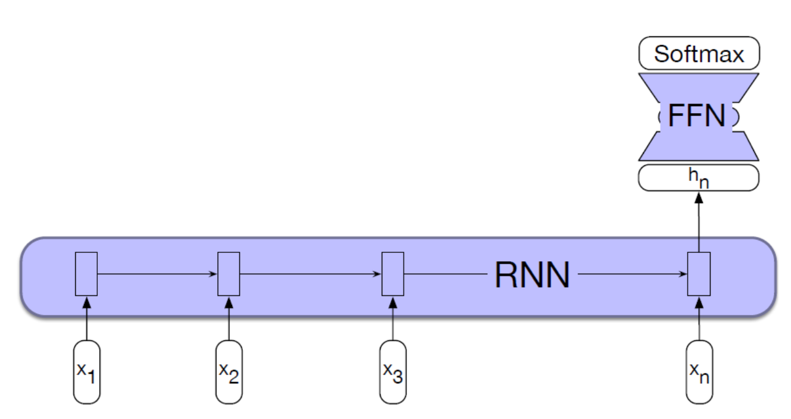

# 3. Recurrent Neural Networks

## 3.1 인공 신경망

 
- 입력(Input): 여러 개의 숫자($x_1, x_2, x_3$)를 입력으로 받음
- 가중치(Weight): 각 입력 값에 '중요도'를 의미하는 가중치($w_1, w_2, w_3$)를 곱함.
- 가중치 합(Weighted sum): 가중치가 곱해진 값들을 모두 더하고, 편향(bias, b)를 추가로 더함. → 중간 점수 "z"
- 비선형 활성화 함수: 중간 점수 z를 활성화 함수에 넣어 최종 값 $y$ (또는 $a$)가 최종 출력   

## 3.1.1 활성화 함수
활성화 함수의 예시로는 시그모이드(Sigmoid) 함수 등이 있으며, 활성화 함수에 값을 넣으면 0과 1 사이의 확률 같은 값으로 바뀐다. 
시그모이드 함수가 어떤 숫자 하나($z$)를 0과 1 사이의 값으로 바꾼다면, 소프트맥스 함수는 여러 개의 숫자들($z_1, z_2, ..., z_k$)을 0과 1 사이의 값으로 바꿔준다. 
따라서 시그모이드 함수를 일반화시키면 소프트맥스(Softmax) 함수가 된다.   

 
그렇다면 공식에 대해서 이해해보자. 다르게 작성하면 이렇게 쓸 수도 있다.   
$\text{softmax}(z)=\frac{e^{z_i}}{\sum_{j=1}^{K}e^{z_j}} \quad \text{for } i = 1, 2, \ldots, K$   
$exp(z_1)$은 $e^{z_i}$와 동일한 의미이다. 여기서 $e$는 오일러 수를 나타낸다. $exp$를 계산하면 음수는 양수가 되고, 각 숫자의 차이를 확실하게 만든다. (큰 숫자는 더 크게, 작은 숫자는 더 작게) 
$z_i$는 $i$번째 클래스에 대한 모델의 출력값을 의미한다. 
- 분자: $e^{z_i}$ (내가 궁금한 $i$번째 항목의 점수)
- 분모: $\sum_{j=1}^{k} e^{z_j}$ (모든 항목의 점수 총합) 

즉, 음수를 양수로 바꾸고 총합을 분모로, 개별 값을 분자로 넣어 해당 항목의 확률을 구한 것이 Softmax 함수이다. 

## 3.2 피드포워드 신경망 (FFN)

## 3.2.1 FFN
 
__피드포워드 신경망 (Feedforward Neural Networks, FFN)__ 은 뉴런들을 여러 층으로 쌓아올린 구조이다. FFN은 3개의 층으로 구분된다. 
- 입력층 (Input Layer, $x$): 데이터를 처음 받는 곳 ($x_1, x_2, ...$)
- 은닉층 (Hidden Layer, $h$): 중간 계산을 담당하는 '뇌'의 핵심 부분 ($h_1, h_2, ...$)
- 출력층 (Output Layer, $y$): 모델의 최종 결론(예측)을 내보내는 곳 ($y_1, y_2, ...$)

입력($x$)이 가중치($W$)와 계산되어 은닉층($h$)이 되고, 은닉층($h$)이 다시 가중치($U$)와 계산되어 최종 출력($y$)이 된다. 
다층 퍼셉트론(Multi-Layer Perceptrons, MLPs)이라고도 불린다. 
정보가 입력층(Input Layer)에서 시작해 중간의 은닉층(Hidden Layer)을 거쳐 출력층(Output Layer)으로, 즉 앞으로만(Feedforward) 흘러가는 구조이다.  

FFN 구조를 실제 감성 분석(Sentiment Analysis) 문제에 어떻게 적용할 수 있을까?
- 입력층 ($X_1, ..., X_n$): 글의 특징(예: 긍정 단어 개수)을 입력받는다.
- 은닉층: 입력된 특징들을 조합하여 복잡한 판단을 내린다.
- 출력층 ($\sigma$): 시그모이드 함수로 0~1 사이의 값(긍정일 확률)을 출력한다.

 
컴퓨터는 글 자체를 바로 이해할 수 없기 때문에, 숫자로 된 '특징'을 뽑아서 알려줘야 한다.

- $x_1$: 문서에 포함된 긍정적인 단어의 수
- $x_2$: 문서에 포함된 부정적인 단어의 수
- $x_3$: "no" 같은 부정어가 있으면 1, 없으면 0
- $x_4$: "I", "you" 같은 1, 2인칭 대명사의 수
- $x_5$: 느낌표(!)가 있으면 1, 없으면 0
- $x_6$: 문서의 총 단어 수 (로그 변환)

 

## 3.2.2 Sliding Window
FFN을 '다음 단어 예측하기'(언어 모델링) 문제에 적용해보자.
- 작업 (Task): 이전에 나온 단어들($W_{t-1}, W_{t-2}, ...$)을 보고 다음 단어($W_t$)를 맞추기
- 문제점 (Problem): 입력의 길이가 제멋대로(arbitrary length)이다.
- 해결책 (Solution): '슬라이딩 윈도우(Sliding Window)'방식을 사용한다. 슬라이딩 윈도우란 이전에 나온 단어들 중 N개만 고려하는 것이다.   

 
- 입력 (Input Layer): 직전 $N$개의 단어(예: "all", "the")가 입력으로 들어온다.(그림에서는 $N=3$을 가정하고 $w_{t-3}, w_{t-2}, w_{t-1}$을 보여준다.)
- 원-핫 벡터 (One-hot vectors): 컴퓨터는 "all"이라는 단어를 모르므로, 사전에 있는 992번째 단어라는 의미로 [0, 0, ..., 1, ..., 0] (992번째만 1) 같은 '원-핫 벡터'로 변환한다.
- 임베딩 (Embedding Layer E): 원-핫 벡터는 너무 크고 비효율적이므로 '임베딩(Embedding)' 과정을 거친다. 임베딩은 각 단어를 의미를 함축한 저차원의 벡터로 바꿔주는 조회용 표이다.
- 연결 (Concatenation): "all"의 임베딩 벡터와 "the"의 임베딩 벡터를 옆으로 이어 붙여 하나의 긴 벡터로 만든다.
- 은닉층 (Hidden Layer h): 긴 벡터를 FFN의 은닉층에 넣어 복잡한 계산을 수행한다.
- 출력 (Output Layer y / Softmax): 은닉층의 결과를 출력층으로 보내고, 소프트맥스(Softmax)를 적용한다.
- 결과: "aardvark"일 확률 0.1%, "do"일 확률 0.5% ... 처럼 사전 속 모든 단어에 대한 '다음 단어일 확률'이 계산되어 나온다.

한 문장으로 동작을 정리하먼 "FFN 언어 모델은 (1)이전 단어들을 임베딩 벡터로 바꾸고 (2)전부 이어 붙여서 (3)FFN에 넣은 뒤 (4)소프트맥스로 다음 단어 확률을 계산한다"고 할 수 있다. 
 

### 3.2.3 FFN의 한계
언어는 시간의 흐름(temporal), 즉 순서가 매우 중요하지만 FFN 모델은 단어의 순서를 완전히 무시한다. FFN 언어 모델은 '슬라이딩 윈도우'를 사용하지만, 고정된 창문($N$개) 바깥의 정보는 절대 볼 수 없다. 
예를 들어 "나는 프랑스에서 태어났고 ... (중략) ... 그래서 ___ 말 잘한다."는 문장이 있다고 하자. 빈칸을 채우려면 저 멀리 있는 '프랑스'라는 단어가 필요한데, 윈도우 크기가 3이라면 FFN은 이 정보를 놓치게 된다. 
FFN과는 다른 방식으로 시간을 표현하는 새로운 딥러닝 구조로 __순환 신경망(RNNs)__ 과 그 __변형들(LSTMs)__ 이 등장했다. 

## 3.3 순환 신경망(RNN)

### 3.3.1 RNN

__RNN (Recurrent Neural Networks)__ 이란 네트워크 연결 안에 '순환(cycle)' 고리를 가진 신경망이다.  
이 순환 고리 때문에, 특정 유닛(뉴런)의 현재 값은 '과거 자신의 출력값'에 직간접적으로 영향을 받는다. 
FFN처럼 정보가 앞으로만 흐르고 끝나는 게 아니라, 과거의 정보가 다시 현재의 계산에 사용되는 '기억' 장치가 있는 모델이다.  

 
가장 기본적인 RNN 구조인 Simple Recurrent Nets(Elman net)을 살펴보자.
   

1. 현재 입력($x_t$)이 은닉층($h_t$)으로 들어간다.
2. 은닉층($h_t$)이 출력($y_t$)을 만든다.
3. 은닉층($h_t$)에서 다시 자기 자신으로 돌아오는 순환 고리를 통해 현재 시점($t$)의 은닉층 값($h_t$)은 현재 시점의 입력($x_t$)과 이전 시점($t-1$)의 은닉층 값($h_{t-1}$) 두 가지 모두에 의존한다.

RNN의 '기억'이란 "이전 단계의 은닉층 값($h_{t-1}$)이 현재 단계의 은닉층($h_t$) 계산에 영향을 미치는 것"이다.  

 

### 3.3.2 RNN 동작 원리

 
- 현재 입력($x_t$)이 가중치 $W$와 곱해진다.
- '직전 hidden layer'라고 표시된 $h_{t-1}$이 가중치 $U$와 곱해진다.
- 이 두 결과를 더한 뒤, 활성화 함수($g$)를 거쳐 현재 은닉 상태($h_t$)가 완성된다.
- 완성된 $h_t$는 다시 가중치 $V$와 곱해져 최종 출력 $y_t$를 만든다.

 
이 그림을 두 개의 수식으로 완벽하게 요약하면 다음과 같다. 
은닉 상태 계산: $h_t = g(Uh_{t-1} + Wx_t)$ (현재 은닉 상태 = (이전 은닉 상태 × U) + (현재 입력 × W)) 
최종 출력 계산: $y_t = softmax(Vh_t)$ (softmax(현재 출력 = 현재 은닉 상태 × V)) 
현재 은닉 상태($h_t$)를 계산하려면 반드시 이전 은닉 상태($h_{t-1}$)가 먼저 계산되어 있어야 한다. 따라서 RNN은 문장 같은 순서가 있는 데이터(sequence)를 처음부터 끝까지 순서대로(incremental) 처리해야만 한다.  

RNN의 학습도 기본적으로 FFN과 비슷하다. 훈련 세트(training set)가 필요하고, 모델이 얼마나 틀렸는지 측정하는 손실 함수(loss function)가 필요하며, 틀린 값을 바탕으로 가중치를 수정하는 역전파(backpropagation)를 사용한다. 
RNN의 가중치는 다음과 같다.
- W: 입력($x_t$)에서 은닉층($h_t$)으로 가는 가중치
- U: 이전 은닉층($h_{t-1}$)에서 현재 은닉층($h_t$)으로 가는 가중치(기억)
- V: 현재 은닉층($h_t$)에서 최종 출력($y_t$)으로 가는 가중치

 

### 3.3.3 RNNs: unrolling

 
RNN은 FFN과 달리 '시간'이라는 개념이 있어서 문제가 좀 더 복잡하다. 
현재($t$)의 은닉 상태($h_t$)는 현재 출력($y_t$)뿐만 아니라, 미래의 모든 출력($y_{t+1}, y_{t+2}, ...$)에도 영향을 준다. 따라서 $y_2$를 잘못 예측한 것은, 그 단계의 가중치(W, U, V)뿐만 아니라, $y_1$를 처리할 때 사용했던 과거의 가중치(W, U, V)의 영향도 받은 것이다. 
시간을 거슬러 올라가며(Backpropagation) 오류를 전파해야 하는데, 문장이 길어질수록 계산이 점점 더 길고 복잡해진다. 
 

**Unrolling**이란 RNN의 순환 구조를 특정 입력 시퀀스의 길이만큼 길게 펼쳐서, 순환 고리가 없는 아주 깊은 FFN처럼 만드는 것이다.
이렇게 펼쳐진 네트워크는 더 이상 순환 고리가 없기 때문에, 우리가 이미 아는 일반적인 역전파 알고리즘을 그대로 적용해서 가중치를 학습시킬 수 있다.

### 3.3.4 RNN LM

따라서 언어 모델 별 문맥의 크기는 다음과 같다. 
- N-gram LM: 'n-1'개의 단어만 기억함
- FFN LM: '슬라이딩 윈도우' 크기만큼만 기억하며 크기는 고정되어 있음
- RNN LM: 이론상 기억력에 한계가 없음; $h_{t-1}$(이전 은닉 상태)가 모든 과거 정보를 압축해서 담고 있기 때문 

 

 
FFN은 이전 3개 단어의 임베딩($e_{t-2}, e_{t-1}, e_t$)를 한번에 받아 $h_t$를 만들고, 다음 단어 예측 $y_t$을 한다. $e_{t-3}$이나 $e_{t-4}$ 같은 과거의 정보는 사용되지 않는다. 
RNN은 단어를 하나씩 순서대로 입력받아 $e_{t-1}$과 이전 기억($h_{t-2}$)을 조합해 $h_{t-1}$을 만든다. 따라서 input data에 대한 정보가 h들에 저장된다. 

 

 
RNN 언어 모델의 계산 과정은 다음과 같다.
1. 입력 준비: 문장을 토큰(단어)의 원-핫 벡터 시퀀스로 준비한다.
2. 임베딩: 현재 $t$번째 토큰 $x_t$를 임베딩 행렬 $E$를 이용해 임베딩 벡터 $e_t$로 변환한다.
    - $e_t = Ex_t$
3. 은닉 상태 계산: 현재 임베딩 $e_t$와 이전 은닉 상태 $h_{t-1}$을 공식에 넣어 현재 은닉 상태 $h_t$를 계산한다.
    - $h_t = g(Uh_{t-1} + We_t)$
4. 예측: 현재 은닉 상태 $h_t$를 가중치 $V$와 곱하고 소프트맥스 함수를 통과시켜, 사전의 모든 단어에 대한 확률 $\hat{y}_t$을 얻는다.
    - $\hat{y}_t = softmax(Vh_t)$

이때 RNN 계산에 사용되는 행렬/벡터의 모양은 사진과 같다.   

 

$\hat{y}_t$는 $|V|$개의 확률값을 가진 벡터이므로 벡터에서 $k$번째 위치의 값이 다음 단어가 $k$일 확률이다. 
문장 전체의 확률은 각 단계에서 '실제 정답 단어'가 나타날 확률을 모두 곱한 것이다. 

### 3.3.5 RNN 모델 학습

__자기 지도 학습 (Self-supervision)__ 방식은 텍스트를 가져와 모델에게 문장의 일부를 보여주고 다음 단어를 맞추도록 시키는 방식이다. 텍스트 자체가 문제와 정답 역할을 동시에 하고 인간이 필요하지 않기 때문에 "스스로(Self) 정답을 찾아(Supervision) 학습한다"고 한다. 
모델의 예측이 실제 정답 단어와 최대한 비슷해지도록(오차를 최소화하도록) 훈련시키고, 오차를 측정하는 방법으로 교차 엔트로피라는 손실 함수를 사용한다. 
 

__교차 엔트로피(Cross-entropy loss)__ 는 모델의 예측과 실제 정답 사이의 거리 또는 차이를 측정한다. 
$L_{CE}=-\sum_{w\in V}y_{t}[w]log\hat{y}_{t}[w]$ 
이 수식은 교차 엔트로피의 정의이며 각 항목이 나타내는 것은 다음과 같다.
- $\sum_{w\in V}$: V(Vocabulary)에 있는 모든 단어($w$)에 대해 계산을 수행해서 다 더하라는 뜻
- $y_t[w]$: $t$ 시점의 '실제 정답' 확률입니다.실제 정답은 원-핫 벡터이므로 진짜 정답 단어의 위치만 1이고, 나머지 단어는 전부 0
- $\hat{y}_t[w]$: $t$ 시점의 '모델의 예측' 확률

 

$y_t[w]$ (실제 정답)는 정답 단어를 제외한 모든 곳에서 0이다. 따라서 단어 실제 단어가 아닌 $y_t[w]$가 0이므로, 0 * log(...)가 되어 계산할 필요 없이 0이 되어 사라진다. 유일하게 살아남는 항은 실제 정답 단어($w_{t+1}$)의 항이고, $y_t[w_{t+1}]$ 값은 1이다. 따라서 공식을 다음과 같이 축약할 수 있다. 

$L_{CE}(\hat{y}_{t},y_{t})=-log\hat{y}_{t}[w_{t+1}]$ 
따라서 모델이 실제 정답 단어($w_{t+1}$)에 대해 예측한 확률($\hat{y}_t[w_{t+1}]$)이 얼마인지만 보고, 거기에 -log를 붙이면 된다. 

 

__교사 강요 (Teacher Forcing)__ 는 모델이 무엇을 예측했든 상관없이 다음 단계의 입력으로는 무조건 실제 정답 단어를 넣어주는 방식이다. 
이는 모델이 초반에 한 번 실수하더라도 그 실수가 뒤따라오는 모든 예측을 망치는 것을 방지한다. 항상 올바른 문맥(context)을 제공받기 때문에 모델이 훨씬 빠르고 안정적으로 학습할 수 있다. 

 

 
다음은 RNN 언어 모델 학습 과정이다. 
1. 입력 (Input Embeddings): "So", "long", "and", "thanks", "for" ... 라는 실제 정답 단어들이 순서대로 RNN에 입력된다.
2. RNN: RNN은 각 단어를 받으면서, 과거의 '기억'(hidden state, $h$)을 다음 단계로 계속 전달한다. 
3. 예측 (Softmax): RNN은 각 단계에서 다음 단어가 무엇일지를 예측한다.
4. 손실 계산 (Loss): 모델의 예측(예: $\hat{y}_{long}$)과 실제 다음 단어("long")를 비교하여, 교차 엔트로피 손실(-log \hat{y}_{long})을 계산한다. 
5. 전체 손실: 문장 전체에 대해 각 단계의 손실을 모두 구한 뒤, 평균을 낸다.
6. 학습: 모델은 이 '전체 평균 손실'을 가장 작게 만드는 방향으로 가중치(W, U, V)들을 업데이트한다.

 

단어를 벡터로 만드는 '입력 임베딩 행렬(E)'과, 은닉 상태($h_t$)를 단어 확률로 바꾸는 '출력 행렬(V)'은 하는 일(단어 $\leftrightarrow$ 벡터)이 매우 비슷하며, 실제로도 비슷한 값을 갖는 경향이 있다.  
__가중치 공유 (Weight Tying)__ 는 V라는 행렬을 따로 학습시키지 말고, E 행렬을 뒤집은 것($E^T$, 전치 행렬)을 V 대신 사용하는 방식이다. 
이는 기존 수식 $\hat{y}_t = softmax(Vh_t)$ 를 $\hat{y}_t = softmax(E^T h_t)$ 로 변경한 것이다. 
V라는 거대한 행렬을 통째로 학습시킬 필요가 없어져서, 모델이 학습해야 할 파라미터(가중치) 수가 크게 줄어 학습 속도를 높이고 과적합을 방지하는 데 도움이 된다. 

 

### 3.3.6 RNN 응용

 
문장 속 모든 단어에 대해 각각 라벨을 붙이는 작업이다. 품사 태깅이 대표적이다. 

1. 각 단어("Janet", "will"...)가 RNN에 순서대로 입력됩니다.
2. RNN은 매 단계마다 태그(명사, 동사...)에 대한 확률을 내보낸다.
3. 각 단어 위에서 가장 확률이 높은 태그를 선택(Argmax)한다.

 

 
문장 전체를 읽고, 문장 전체에 대한 하나의 라벨로 분류하는 작업이다. 감성 분석도 포함될 수 있다.

1. 문장의 모든 단어($x_1$ ... $x_n$)가 RNN에 순서대로 입력된다.
2. 중간 단계의 출력($y_1, y_2...$)은 모두 무시한다.
3. RNN이 문장의 마지막 단어($x_n$)까지 다 읽고 난 후의 최종 은닉 상태($h_n$)만 사용합니다. $h_n$에는 문장 전체의 정보가 압축되어 있기 때문이다.
4. $h_n$을 FFN과 소프트맥스에 넣어 최종 분류(예: "긍정" 90%, "부정" 10%)를 수행한다.

마지막 $h_n$만 쓰는 대신, 모든 $h_i$를 전부 평균(mean pooling)내서 사용할 수도 있다. 

 

 
__Autoregressive (자기 회귀)__ 란 본인의 출력을 다시 입력으로 사용하는 것이다. 
학습된 RNN 모델을 이용해 새로운 텍스트를 창작하도록 사용할 수 있다. 

1. &lt;S&gt; 시작 토큰을 RNN에 첫 입력으로 넣는다.
2. RNN이 다음 단어로 "So"를 가장 높은 확률로 예측하면 "So"를 다음 단계의 입력으로 넣는다.
3. RNN이 "So" 다음 단어로 "long"을 예측하면, "long"을 다음 입력으로 넣는다.
4. 이 과정을 계속 반복하면 모델이 "So long and thanks for..."처럼 문장을 스스로 생성한다.

  
 

FFN을 여러 층 쌓듯이, RNN도 여러 층으로 쌓는 방식이다. 더 깊은 층을 통해 데이터의 더 복잡하고 추상적인 패턴을 학습할 수 있다.
- RNN 1 (1층): 원래대로 입력($x_1, x_2...$)을 받아서 은닉 상태 시퀀스를 만든다.
- RNN 2 (2층): 입력($x$)을 직접 받는 대신, 1층 RNN이 만든 은닉 상태 시퀀스를 입력으로 받는다.
- RNN 3 (3층): 2층 RNN의 은닉 상태 시퀀스를 입력으로 받는다
- 최종 출력: 가장 꼭대기 층(RNN 3)의 출력이 최종 결과($y_1, y_2...$)가 된다.

  
 

 
표준 RNN은 "나는 어제 ___ 먹었다"에서 빈칸을 예측할 때, 뒤에 오는 "먹었다"는 정보를 볼 수 없다. 오직 과거("나는", "어제")만 보기 때문이다. 
이를 두 개의 RNN을 동시에 사용해 보완하는 아이디어가 **Bidirectional RNNs** 이다. 
- Forward RNN (정방향): 문장을 왼쪽에서 오른쪽으로 읽는다. ("Janet" $\rightarrow$ "bill")
- Backward RNN (역방향): 문장을 오른쪽에서 왼쪽으로 읽는다. ("bill" $\rightarrow$ "Janet")

각 단어 위치에서 정방향 RNN의 은닉 상태($h_t^f$)와 역방향 RNN의 은닉 상태($h_t^b$)를 하나로 이어 붙인다. 
이렇게 만들어진 $h_t$는 해당 단어의 과거 문맥(forward)과 미래 문맥(backward)을 모두 알게 되므로, 문맥이 중요한 작업에서 훨씬 강력한 성능을 낸다. 

  
 

 

RNN Sequence Classification 아이디어와 Bidirectional RNNs 아이디어를 합친 것으로, 문장 전체를 분류할 수 있다.
- 정방향 RNN (RNN 1): 문장을 끝까지($x_n$) 읽고 마지막 은닉 상태($\vec{h}_n$)를 가져온다.
- 역방향 RNN (RNN 2): 문장을 거꾸로 끝까지($x_1$) 읽고 (역방향의) 마지막 은닉 상태($\bar{h}_1$)를 가져온다.
- 두 벡터($\vec{h}_n$와 $\bar{h}_1$)를 하나로 이어 붙여 결합된 벡터(문장 전체의 앞뒤 정보를 모두 요약한)를 FFN/소프트맥스에 넣어 최종 분류를 수행한다.