# 6. Transformer

## 6.1 Static Embeddings의 문제점

word2vec와 같은 static embeddings는 정적이다.  
개별 단어의 embedding에 context에서 어떤 의미 변화가 있는지를 반영하지 않는다.  
"The chicken didn't cross the road because it was too tired" 같은 문장이 있을 때, "it"은 무엇을 가리키는지(chicken) 표현하지 못하고 사전적 의미만 표현한다.  

 

## 6.2 Contextual Embeddings

Static Embeddings 대신, 단어의 의미가 문맥(주변 단어들)에 따라 달라지는 벡터 표현인 **Contextual Embeddings**을 사용한다.  
Contextual Embedding은 Attention을 통해 만들어지는데, Attention이란 단어의 의미를 파악하기 위해 주변 단어들 중 어떤 단어에 더 주목(attention)해야 할지 결정하는 기술을 말한다.  

 

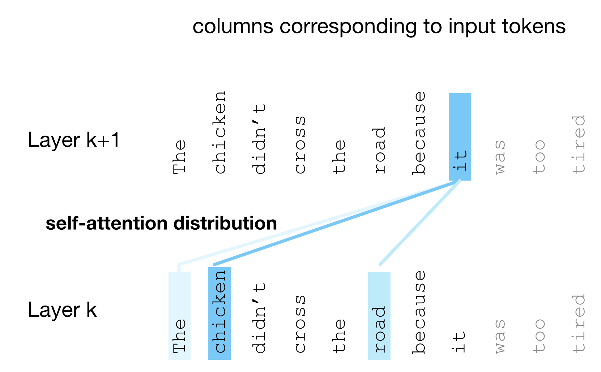 
"The chicken didn't cross the road because it was too tired"라는 문장이 주어졌다.  
(k+1)번째 층에서 'it' 의 의미를 계산할 때, (k)번째 층의 'chicken' 과 'road' 를 강하게 주목하는 것을 볼 수 있다.  
Attention은 이전 층의 주변 토큰들로부터 선택적으로 정보를 통합하여 현재 토큰의 임베딩(의미)을 계산하는 메커니즘이다. 간단히 말해, '벡터들의 가중 평균'을 구하는 방법이다.  

 

## 6.3 Attention

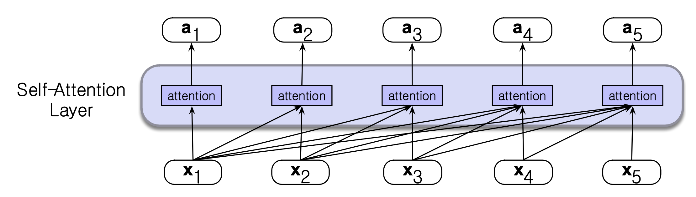 
Self-Attention Layer의 기본 구조를 알아보자.  
언어 모델이 다음 단어를 예측할 때, 미래의 단어를 미리 보고 정답을 맞히면 안된다.  
따라서 어텐션은 현재 단어($x_i$)와 그 이전에(왼쪽에) 나온 단어들만 참고해서 계산한다.  
$a_1$을 계산할 때는 $x_1$만 확인하고, $a_2$를 계산할 때는 $x_1$과 $x_2$만 확인하는 식이다.  

 

이것을 수식으로 나타내보자. 입력은 $x_1, ..., x_7, x_i$이고, $a_i$의 값을 구한다.  
핵심은 __"현재 단어와 이전 단어들의 '유사도'를 구해서, 그 유사도만큼 '가중 평균'을 구한다"__ 는 것이다.  

 

$score(x_i,x_j)=x_i \cdot x_j$ : 공식을 이용해 현재 단어 $x_i$와 이전의 단어 $x_j$의 유사도를 계산한다.  
$\alpha_{ij}=softmax(score(x_i,x_j)) \forall j \leq i $ : score 계산 값을 softmax 함수에 넣어 0~1 사이의 값으로 변환한다. 이때 $\alpha_{ij}$가 어텐션 가중치이고, $j \le i$ 라는 조건은 이전 단어들만 본다는 규칙을 나타낸다.  
$a_i=\sum_{j \le i} \alpha_{ij}x_j$ : 가중치($\alpha_{ij}$)를 각 단어의 원래 벡터($x_j$)에 곱해서 모두 더한다.  
간단히 말해, $a_i$라는 새로운 벡터는 현재 단어 $x_i$와 유사도가 높은 이전 단어 $x_j$들의 의미는 많이 가져오고, 유사도가 낮은 단어들의 의미는 조금만 가져와서 합친 결과물이라고 할 수 있다.  

 

## 6.3.1 Attention Head

실제 attention head에서는 x_i, x_4와 같은 벡터를 직접 사용하는 것 대신에, 3개의 분리된 roles로 나타낸다.
- Query (q): 현재 단어가 필요한 정보를 요청(질문)하는 벡터
- Key (k): 다른 단어가 담고 있는 정보를 알려주는 벡터
- Value (v): 앞에 있는 벡터가 가진 실제 의미(정보) 벡터

 

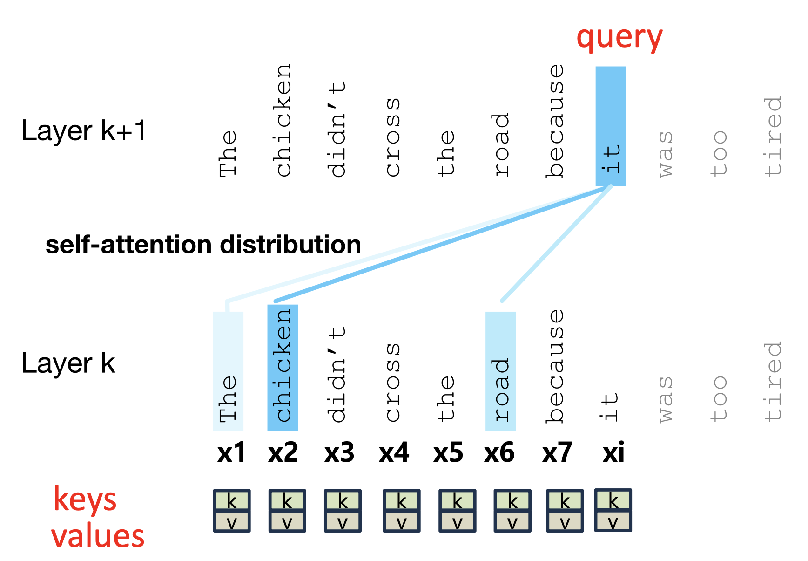 

1. Query 생성: 8번째 단어인 'it'의 문맥적 의미를 계산하기 위한 쿼리(q) 생성
2. Key와 Value 생성:'it'을 포함한 이전의 모든 단어들('The', 'chicken', 'didn't', 'road'...)은 각자 자신의 키(k)와 밸류(v)를 생성함
3. Score 계산 및 Value 가져오기: 'it'의 쿼리(q)는 모든 단어의 키(k)와 하나씩 비교되며 점수를 매김.
    - q('it') $\cdot$ k('chicken') ➔ 매우 높은 점수 (관련성 매우 높음)
    - q('it') $\cdot$ k('road') ➔ 높은 점수 (관련성 낮음)
    - 점수(관련성)가 어텐션 가중치가 된다. 

어텐션은 이 가중치(점수)가 높은 단어들의 밸류(v), 즉 'chicken'의 실제 의미와 'road'의 실제 의미를 주로 가져와서 합쳐 'it'의 새로운 의미 벡터를 생성함  

 

그렇다면 Q, K, V는 어떻게 생성할까? 모델은 3개의 서로 다른 가중치 행렬을 학습한다.
- $W^Q$ (쿼리용 행렬), $x_i$에 $W^Q$를 곱해 쿼리($q_i$)를 만듦
- $W^K$ (키용 행렬), $x_i$에 $W^K$를 곱해 키($k_i$)를 만듦
- $W^V$ (밸류용 행렬), $x_i$에 $W^V$를 곱해 밸류($v_i$)를 만듦

단어 벡터($x_i$)를 가지고, 학습된 3개의 역할 변환기($W^Q, W^K, W^V$)를 통과시켜 3가지 전문 역할(q, k, v)을 수행하는 벡터 3개를 복제한다.  

 

전체 계산 과정을 정리하면 다음과 같다.
1. Q, K, V 생성: $q_i = x_i W^Q$ , $k_j = x_j W^K$ , $v_j = x_j W^V$
2. 점수 계산: $score(x_i, x_j) = \frac{q_i \cdot k_j}{\sqrt{d_k}}$
    - $d_k$ 값이 너무 크면 $q_i \cdot k_j$의 값도 너무 커져서, 소프트맥스 함수를 통과할 때 값이 0 아니면 1로 치우치는 문제가 발생함
    - $q_i \cdot k_j$를 $\sqrt{d_k}$ (키 벡터의 차원 $d_k$의 제곱근)으로 나눠 scaling 해줌
3. 가중치($\alpha_{ij}$) 계산: $\alpha_{ij} = softmax(score(x_i, x_j))$ ( $j \le i$, 왼쪽 단어들만)
4. 최종 출력($a_i$) 계산: $a_i = \sum_{j \le i} \alpha_{ij} v_j$

 

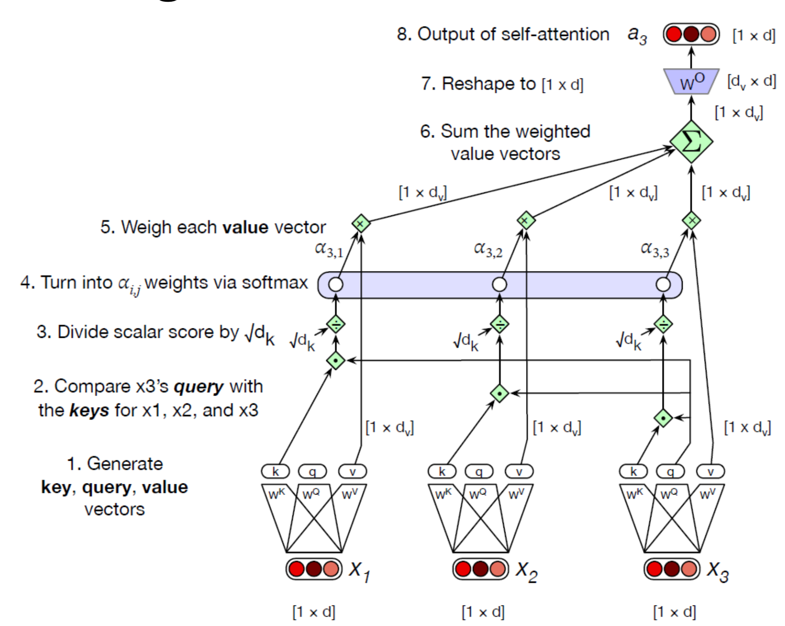  
이 그림은 입력 단어 $x_1, x_2, x_3$가 있을 때, 세 번째 단어의 새로운 벡터 $a_3$가 만들어지는 전체 과정을 나타낸다.
1. Q, K, V 생성: $W^Q, W^K, W^V$ 행렬을 곱해서 Q, K, V를 생성함
2. 점수 계산: $x_3$의 쿼리($q_3$)를 모든 키($k_1, k_2, k_3$)와 내적하여 관련성 점수를 계산함
3. 스케일링: 계산한 점수들을 $\sqrt{d_k}$로 나누어 값이 너무 커지는 것을 방지함
4. Softmax: 스케일링된 점수들을 소프트맥스 함수에 넣어 0~1 사이의 어텐션 가중치($\alpha_{3,1}, \alpha_{3,2}, \alpha_{3,3}$)로 변환함, 어텐션 가중치의 총합은 1
5. 가중치 적용: 어텐션 가중치($\alpha$)를 각 단어의 밸류($v$) 벡터에 곱함
    - ($\alpha_{3,1} \times v_1$), ($\alpha_{3,2} \times v_2$), ($\alpha_{3,3} \times v_3$)
6. 가중합: 가중치가 적용된 밸류 벡터들을 하나로 더함
    - $\sum \alpha_{ij}v_j$
7. $W^O$ 추가 행렬을 곱해 최종 출력

 

## 6.4 Multi-Head Attention

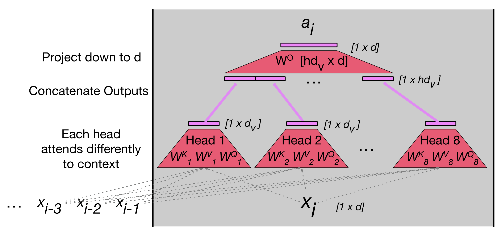 

여러 개의 attention head를 사용해 각 헤드가 서로 다른 종류의 문맥적 관계나 패턴을 학습하도록 역할을 분담하는 것이다.  
Q, K, V 계산을 헤드 개수($h$)만큼 반복한다. 이때 각 헤드마다 서로 다른 가중치 행렬($W^{Qc}, W^{Kc}, W^{Vc}$)를 사용한다.  
각 헤드의 score와 softmax 계산이 완료되면, 각 헤드가 계산한 결과($head^1, head^2, ..., head^h$)를 모두 하나로 이어붙인다(concat, $\oplus$)  
이 길어진 벡터에 마지막으로 $W^O$라는 행렬을 곱해서 원래의 벡터 크기($d$)로 다시 압축한다.  
이것이 '멀티-헤드 어텐션'의 최종 출력($a_i$) = $MultiHeadAttention(x_i,[x_1, \cdot, x_N])$  

 

## 6.5 Layer Norm

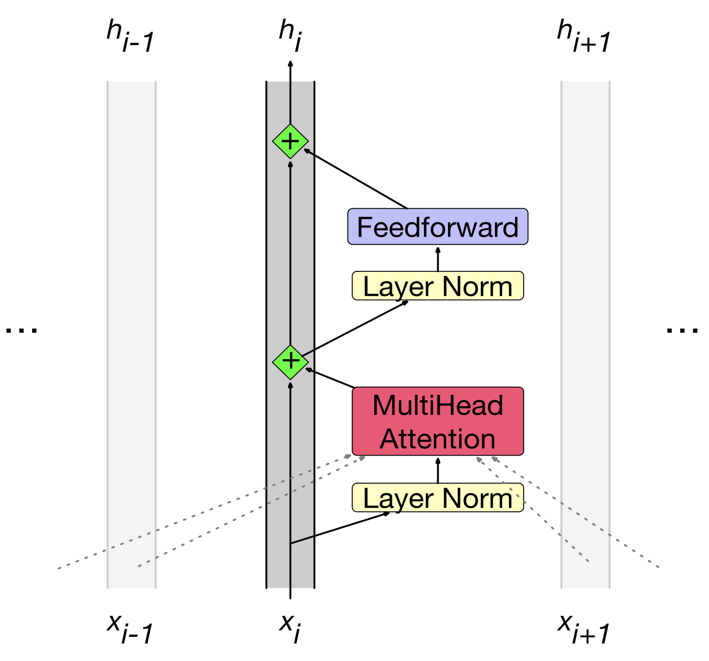 
위의 그림은 트랜스포머 블록 하나에서 단어(토큰) 하나가 겪는 처리 경로를 보여준다. 이 경로를 '잔차 스트림(residual stream)'이라고도 부른다.  
이 블록은 크게 MultiHead Attention, Feedforward, Layer Norm(층 정규화), +(잔차 연결)로 구성되어 있다.  

 

Attention이 문맥 정보를 취합했다면, FFN은 이 정보를 처리하고 소화하는 역할을 맡는다.  
FFN은 모델에 비선형성을 더해준다. 만약 FFN이 없다면, 모델 전체가 거대한 행렬 곱셈 1개로 압축되어 버려서 복잡한 패턴을 학습할 수 없다.  
또한 FFN은 보통 입력 차원을 더 큰 차원으로 확장해 어텐션이 가져온 복잡한 정보들을 더 효과적으로 조합하는 작업을 마치고 다시 원래 차원으로 압축한다.  
$FFN(x_i)=ReLU(x_iW_1+b_1)W_2+b_2$ 공식으로 계산된다.  

 

Layer Norm은 학습 과정을 안정시키는 안전장치이다.  
신경망 층이 깊어질수록 각 층을 통과하는 벡터들의 값이 너무 커지거나 작아지는 등 불안정해질 수 있는데, Layer Norm은 이런 값들을 일정한 범위로 정규화시켜서 학습 과정을 안정적으로 만든다.  
Layer Norm은 MultiHead에 들어가기 전, FFN에 들어가기 전 총 2번 사용된다.  

 

원리는 z-score의 변형이다. z-score는 어떤 값이 평균에서 얼마나 떨어져 있는지를 표준편차 단위로 나타내는 값이다. Layer Norm의 공식을 통해 이해해보자.
- 평균($\mu$) 계산: $\mu = 1/d \sum_{i=1}^d x_i$
- 표준편차($\sigma$) 계산: $\sigma=\sqrt {1/d \sum _{i=1}^d (x_i-\mu )^2}$
- 정규화($\hat{x}$) 계산: $\hat x=\frac{(x-\mu)}{ \sigma }$, (자신의 값 - 평균) / 표준편차
    - 벡터의 상태: 평균이 0, 표준편차가 1
- $\text{LayerNorm}(x) = \gamma \hat{x} + \beta$
    - $\gamma$ (감마): 정규화된 벡터 $\hat{x}$의 스케일(크기)을 조절
    - $\beta$ (베타): 정규화된 벡터 $\hat{x}$의 이동을 조절

정리해보면 Layer Norm은 어떤 벡터가 어텐션이나 FFN에 들어가기 전에, 그 벡터의 숫자들을 안정적인 범위로 정규화하고(평균 0, 표준편차 1), 모델이 학습한 최적의 $\gamma$와 $\beta$값으로 다시 미세 조정하는 과정이다.  

 

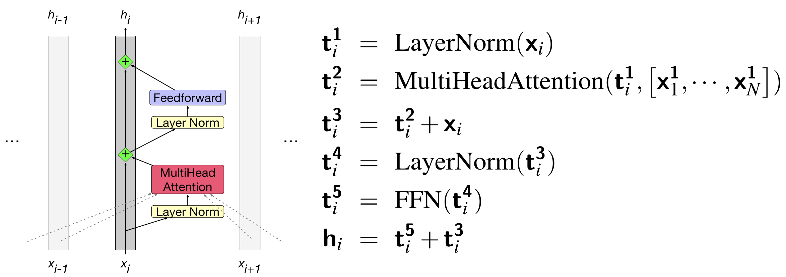  
입력 $x_i$가 블록의 최종 출력 $h_i$가 되기까지의 6단계이다.
1. 입력 $x_i$가 Layer Norm 통과
2. 정규화된 $t_i^1$이 Multi-Head Attention 통과
3. 어텐션 결과 $t_i^2$에 원본 입력 $x_i$를 더함, 잔차 연결
4. 잔차 연결의 결과 $t_i^3$이 Layer Norm를 통과
5. 정규화된 $t_i^4$가 FFN 통과
6. FFN의 결과 $t_i^5$에 FFN의 입력이었던 $t_i^3$을 더함, 잔차 연결

Transformer는 이렇게 만들어진 블록 여러 개를 수직으로 쌓아 올린 구조로, 각 블록의 최종 출력이 다음 블록의 입력이 된다.  

 

FFN이나 Layer Norm 같은 연산은 Residual Stream 안에서만 작동한다.  
하지만 Attention은 다른 스트림과 소통할 수 있다. Attention은 문맥 정보를 한 단어에서 다른 단어로 복사/이동시키는 통로 역할을 한다.  

 

## 6.6 Parallelizing

지금까지는 단일 단어를 계산했지만, GPU는 행렬 계산에 특화되어 있어 한 번에 처리할 수 있다.  
문장의 모든 단어 벡터($x_1, ..., x_N$)를 쌓아서 $[N \times d]$ 크기인 하나의 거대한 입력 행렬 $X$를 만든다.  
X의 각 행은 입력 토큰 하나의 embedding을 나타낸다.  
X는 1K-32K rows를 가질 수 있고, 각 차원은 embedding d(model dimension)를 나타낸다.  

 

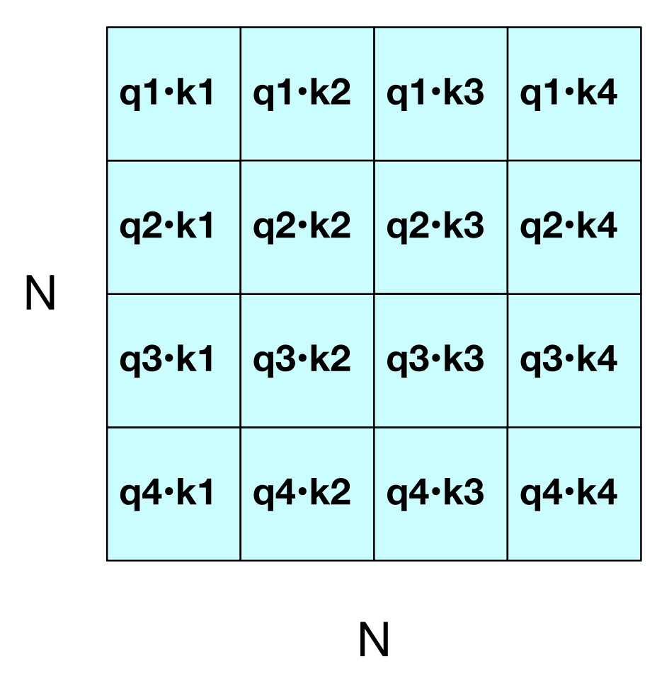 
모든 쿼리가 담긴 $Q$ 행렬과 모든 키가 담긴 $K^T$($K$ 행렬을 뒤집은 것) 행렬을 곱하면 결과로 $[N \times N]$ 크기의 점수 행렬이 나온다.  
이때 Q와 K 간의 유사도를 구하기 위해서는 내적을 계산해야 하는데, Q가 행 벡터이므로 K를 열 벡터로 만들어야 행렬 차원이 맞아 내적이 가능하다. 따라서 K를 전치하여 이를 맞춰준다.  

 

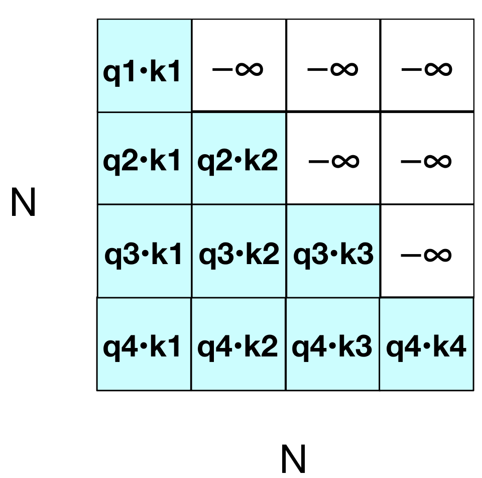 
그런데 $QK^T$ 행렬은 (2행 4열: $q_2 \cdot k_4$)처럼 현재 단어(2번)가 미래 단어(4번)의 정보를 참고하는 점수까지 모두 계산해 버린다. 이는 다음 단어를 예측해야 하는데, 그 다음 단어를 미리 보고 정답을 맞히는 셈이 되기 때문에 치명적인 에러이다.  
이를 방지하기 위해 $QK^T$ 행렬에서 미래에 해당하는 부분(대각선 위쪽, 상삼각행렬)에 $-\infty$ 값을 더한다.  
$-\infty$ 값은 소프트맥스 함수를 통과할 때 0이 되므로, 미래 단어에 대한 어텐션 가중치가 0이 된다. 현재 단어는 자신과 과거의 단어들만 참고할 수 있게 된다.  

 

전체 공식은 다음과 같다.

$$
A = \text{softmax}(\text{mask}(\frac{QK^T}{\sqrt{d_k}}))V
$$

 

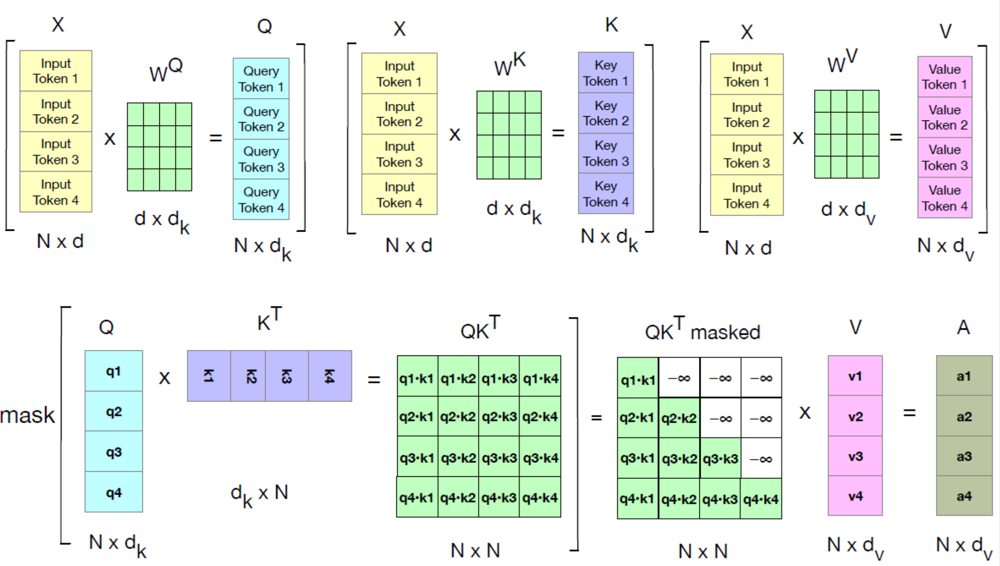  
병렬 멀티 어텐션의 순서를 다시 정리해보자.
1. 입력 $X$ (문장 전체, $N \times d$)가 $W^Q, W^K, W^V$ 행렬과 각각 곱해짐
2. 그 결과, 문장 전체의 쿼리 행렬 $Q$ ($N \times d_k$), 키 행렬 $K$ ($N \times d_k$), 밸류 행렬 $V$ ($N \times d_v$)가 생성됨
3. $Q$와 $K^T$를 곱해 문장 전체의 상호 관련성 점수 행렬 $QK^T$ ($N \times N$)를 만듦
4. 점수 행렬에 마스크($-\infty$로 미래 가리기)를 적용하고, 소프트맥스를 취한 뒤, $V$ 행렬과 곱함
5. 최종적으로 문장 전체의 어텐션 출력 행렬 $A$ ($N \times d_v$)이 출력됨

 

6.5단계의 공식을 축약하여 다음과 같이 표현할 수 있다.  
$O = X + MultiHeadAttention(LayerNorm(X))$ : 1 - 3단계  
$H = O + FFN(LayerNorm(O))$ : 4 - 6단계  

 

병렬 멀티 어텐션을 공식으로 나타내면 다음과 같다.

$$
Q^i=XW^{Qi} ; K^i=XW^{Ki} ; V^i=XW^{Vi} \newline
head_i=SelfAttention(Q^i,K^i,V^i) = softmax(\frac{Q^iK^{iT}}{\sqrt{d_k}})V^i \newline
MultiHeadAttention(X)=(head_1 \oplus head_2 ... \oplus head_h)W^O
$$

Multi-Head Attention 공식과 동일하며, head가 여러개이기 때문에 i 첨자를 붙여서 구분한다.  

점수 행렬($QK^T$)의 크기가 $[N \times N]$ 이다. ($N$ = 문장의 길이)  
문장 길이가 N배가 되면, 필요한 계산량과 메모리는 ($N^2$)배가 된다. 이를 "계산량이 길이에 제곱으로 비례한다"고 한다.  
따라서 Transformer는 한 번에 처리할 수 있는 문장 길이에 제한이 있다.  

## 6.7 token & position embeddings 

입력 행렬 $X(N * d)$ 는 토큰 임베딩과 위치 임베딩이 합쳐진 결과물이다.  

 

토큰 임베딩은 단어의 고유한 의미를 나타내는 벡터이다.  
모델은 단어 사전 같은 임베딩 행렬 $E(|V| x d)$를 가지고 있고, 이 행렬에는 모델이 아는 모든 단어에 대한 벡터(d차원)가 한 줄씩 저장되어 있다.  
"Thanks for all the"라는 문장이 들어오면 각 단어를 토큰화하고 사전 번호로 바꾼다. (예: [5, 4000, 10532, 2224])  
모델은 이 번호에 해당하는 행을 임베딩 행렬 $E$에서 꺼내온다. 예를 들어, 5번째 줄에 저장된 벡터가 "Thanks"의 의미 벡터가 된다.  

 

위치 임베딩은 단어의 순서를 나타내는 벡터이다.  
여러 가지 방법이 있지만, 절대 위치 방식으로 위치 임베딩 행렬'($E_{pos}, N x d$)를 학습한다.  
무작위로 초기화된 임베딩에서 시작해, 학습을 통해 각 위치의 고유한 표현을 나타낸다.  

 

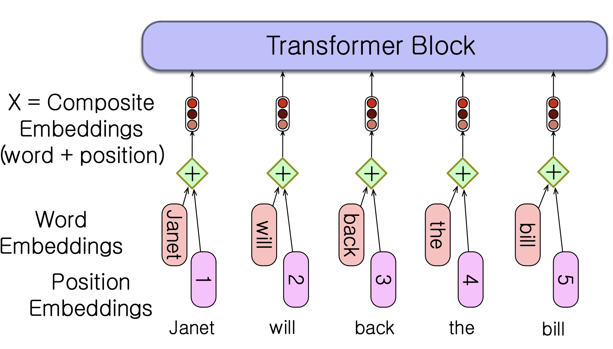 
이렇게 생성된 토큰 임베딩과 위치 임베딩을 더해 최종 입력 행렬 $X$가 완성된다.  

 

## 6.8 language modeling head

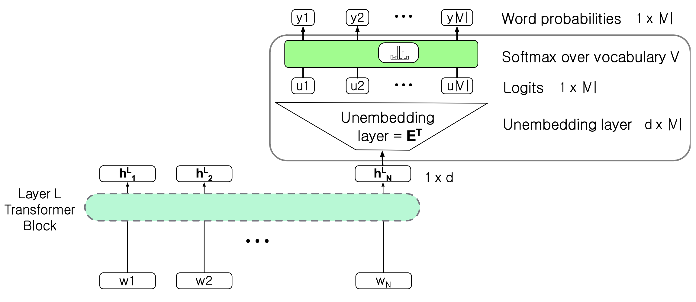  

마지막 트랜스포머 블록(Layer L)에서 나온 최종 벡터 $h_N^L$ (크기 $1 \times d$)가 입력으로 사용된다. $h_N^L$은 문맥이 반영된 최종 요약본이다.  

 

$h_N^L$를 Unembedding layer($d \times |V|$)와 곱해 embedding을 역으로 one-hot-encoding으로 만든다.  
이때 Unembedding layer는 입력 토큰 임베딩 행렬($E$)을 전치하여 사용한다.  
이렇게 입력단에서 단어를 벡터로 만들 때 쓴 행렬($E$)과, 출력단에서 벡터를 다시 단어 점수로 되돌릴 때 쓴 행렬($E^T$)을 서로 공유하는 가중치 공유 (Weight Tying)를 통해 모델이 학습해야 할 파라미터 수를 줄여 모델의 성능을 향상시킨다.  
이 결과로 로짓(Logits)이라는 긴 벡터($1 \times |V|$)가 나온다.  

 

로짓($u$)에는 사전의 모든 단어(|V|개)에 대한 원시 점수가 들어있다.  
Softmax 함수를 통해 로짓을 확률로 변환한다. 결과($1 \times |V|$)는 모든 값을 합하면 1이 되고, 각 값은 0~1 사이가 된다.  

 

## 6.9 Final Transformer Model

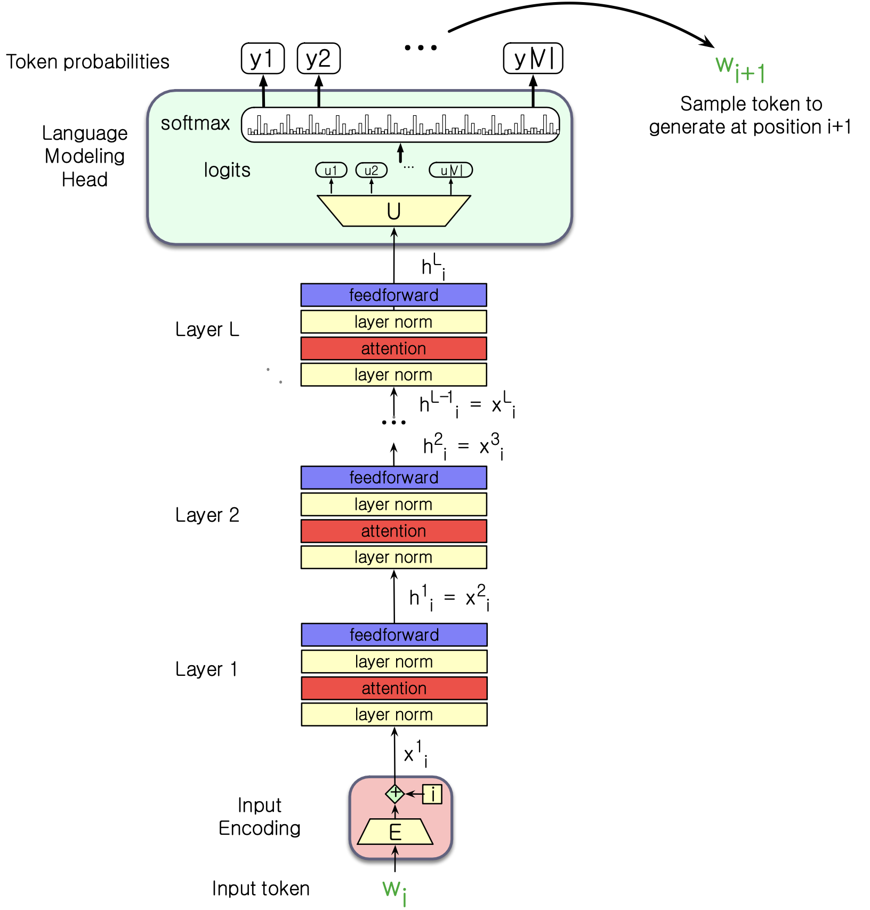  

최종 트랜스포머 모델에 대해 단어 하나($w_i$)의 흐름으로 요약해보자.  
1. Input Encoding: 입력 단어 $w_i$가 '임베딩'(E)과 '위치 임베딩'(i)이 더해져 $x_i^1$이 된다.
2. Stacking: $x_i^1$이 'Layer 1'을 통과해 $h_i^1$이 되고, $h_i^1$이 'Layer 2'를 통과해 $h_i^2$가 되고, 이 과정을 반복해 최종적으로 'Layer L'을 통과해 $h_i^L$이 나온다.
3. Language Modeling Head: 최종 벡터 $h_i^L$이 Unembedding Layer를 거쳐 로짓이 되고, 로직이 softmax 함수를 거쳐 최종 '토큰 확률'($y1, y2, ...$)이 된다.
4. 모델은 이 확률 분포에서 다음 단어 $w_{i+1}$을 '샘플링'(선택)하여 문장을 생성한다.

   

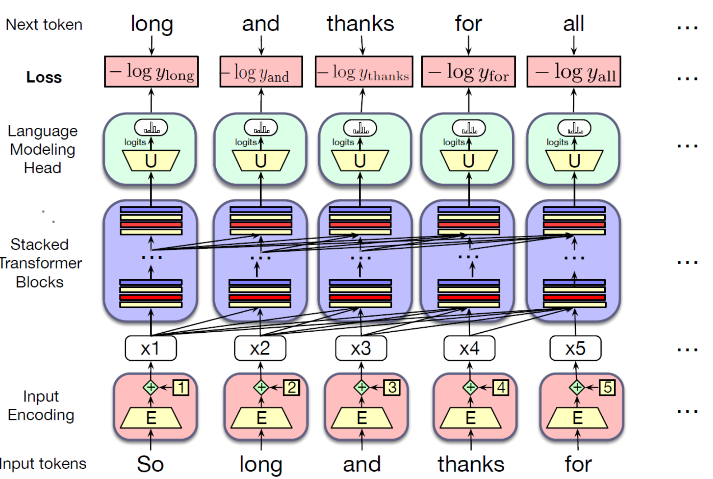  

위의 이미지는 트랜스포머의 학습 과정을 나타낸다. 모델에게 문장의 한 부분($t$번째 단어까지)을 보여주고, $t+1$번째 단어가 무엇일지를 맞히게 한다.  
1. Input tokens: 학습의 재료가 되는 원본 텍스트 데이터이다.
2. Input Encoding: Input tokens를 모델이 이해할 수 있도록 숫자 벡터로 바꾸는 과정이다. 토큰은 토큰 임베딩(의미)와 위치 임베딩이 합쳐져 생성된다.
3. Stacked Transformer Blocks: 입력 인코딩을 거친 벡터들이 트랜스포머 블록 층에 들어가 Self-Attention으로 문맥을 학습한다.
4. Language Modeling Head: 최종 문맥 벡터가 Unembedding Layer를 거쳐 로짓이 되고, 로직이 softmax 함수를 거쳐 최종 토큰 확률이 된다.
5. Next token: 모델이 예측한 단어가 아니라, 우리가 정답으로 알려주는 목표(Target) 단어를 의미한다.
6. Loss: 모델이 계산한 다음 단어 확률 분포($y_{long}$)에 $-log$를 씌워서 계산한다. 정답을 잘 예측했을 때 loss 값은 0에 가까워진다.

학습이란, 이 'Loss' 값들의 총합(평균)을 0에 가깝게 만들기 위해 'Transformer Blocks'와 'Head' 내부의 모든 가중치를 조금씩 수정하는 전 과정을 의미한다.

   

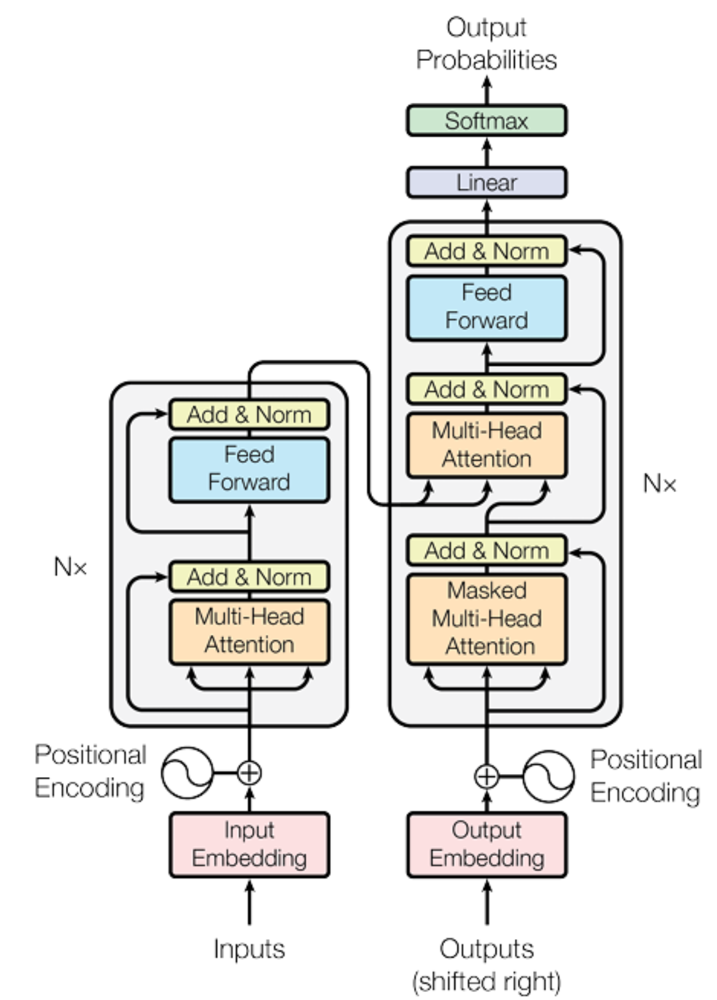 

지금까지는 Decoder-Only(언어 모델)의 구조였다면, 위의 이미지는 오리지널 트랜스포머의 전체 구조를 나타낸다. 이 모델은 기계 번역(예: 영어 → 한국어) 같은 작업에 사용되며, 인코더와 디코더 부분으로 나뉜다.  

### 6.9.1 Encoder

- 역할: 입력 문장(예: 영어 문장)을 받아서 그 의미를 '이해'하고 '압축'하는 부분이다.
- 작동:
    - Inputs: "I am a student" 같은 입력 문장이 들어온다.
    - Input Embedding: 입력 문장을 토큰으로 바꿔 토큰 임베딩(의미) 한다.
    - Positional Encoding: 토큰 임베딩(의미)과 위치 임베딩이 합쳐져 최종 input이 만들어진다.
    - Nx: N개의 인코더 블록을 통과한다. 인코더 블록 안에는 Multi-head Attention을 이용한 문맥 파악, FFN, Layer Norm 등이 있다.
- 결과: 인코더는 문장의 문맥적 의미가 압축된 벡터들의 집합을 만들어낸다.

   

### 6.9.2 Decoder

- 역할: 인코더가 압축한 '의미'를 받아서, 출력 문장을 '생성'하는 부분이다.
- 작동:
    - Outputs: 정답 문장을 한 단어씩  입력받아 다음 단어를 예측하도록 학습한다.
    - Embedding + Positional Encoding: Encoder와 똑같이 벡터로 변환됩니다.
    - Nx Blocks: N개의 디코더 블록을 통과한다. 이때, 디코더 블록은 인코더와 달리 Attention이 2개이다.
        - Masked Multi-Head Attention: 미래의 정답을 미리 볼 수 없도록 Masking한 Attneiton
        - Multi-Head Attention: 디코더가 인코더의 최종 출력물을 확인하는 부분이다. 디코더가 다음에 올 단어를 예측할 때, 자신이 생성한 문장 뿐만 아니라 원본 문장의 의미(인코더 출력물)을 함께 확인한다.
- 출력: 최종 벡터는 Linear 층을 거쳐 Logits가 되고, Softmax를 통과해 다음 단어에 대한 확률이 된다.

 

## 6.10 Scaling Laws

LLM의 성능은 크게 세 가지 요소에 달려있다.
- 모델 크기: 모델이 가진 파라미터(가중치)의 수
- 데이터셋 크기: 모델을 학습시키는 데 사용되는 텍스트 데이터의 양
- 컴퓨팅: 모델을 학습시키는 데 사용되는 총 계산 능력(FLOPS)

스케일링 법칙이란 이 세 가지 요소(크기, 데이터, 컴퓨팅)를 늘리면 모델의 성능(손실(Loss) 값)이 예측 가능한 멱법칙(power-law)에 따라 좋아진다는 규칙이다. 
작은 모델로 잠깐 돌려봐도, 이 법칙(공식)을 사용하면 모델의 최종 성능을 미리 예측할 수 있어 중요하다. 

 

공식은 다음과 같다.
- $L(N) \propto (1/N)^{\alpha_N}$ (모델 크기 N이 커질수록 손실 L이 줄어듦)
- $L(D) \propto (1/D)^{\alpha_D}$ (데이터 D가 많아질수록 손실 L이 줄어듦)
- $L(C) \propto (1/C)^{\alpha_C}$ (컴퓨팅 C가 많아질수록 손실 L이 줄어듦)

 

하지만 모델 크기(N)만 키운다고 성능이 계속 좋아지지 않고, 데이터(D)와 컴퓨팅(C)도 모델 크기(N)에 비례해서 함께 늘려줘야 한다. ($D \propto N$, $C \propto N^2$)  

 

그렇다면 '모델 크기(N)', 즉 파라미터 개수는 어떻게 셀 수 있을까? 정확히는 계산할 수 없고, 근사치를 계산할 수 있다.  

$$
N \approx 2dn_{layer}(2d_{attn}+d_{ff}) \newline 
\approx 12n_{layer}d^2 (assuming \ d_{attn} = d_{ff}/4 = d ) 
$$

- $n_{layer}$: 트랜스포머 블록의 총 층수
- $d$: 모델의 임베딩 차원
    - $d_{ff}$: feed forward의 차원
        - $d \to d_{ff}$ : $d \times d_{ff}$, $d_{ff} \to d : d_{ff} \times d$
        - $\approx 2d \times d_{ff}$
    - $d_{attn}$: multihead attention의 차원
        - 4개의 Matrices $W^Q, W^K, W^V, W^O$로부터 d차원을 입력받아 $d_{attn}$ 차원을 출력한다고 가정
        - 각 행렬의 크기는 $d  \times d_{attn}$ $\approx 4 \times (d \times d_{attn})$
    - 정리하면 $N \approx n_{layer} \times ((4d \times d_{attn})+(2d\times d_{ff}))$ = $12n_{layer}d^2$

   

## 6.11 KV Cache

학습 시, 문장 전체를 모델에 한꺼번에 넣어 병렬로 계산할 수 있다.  
$A = \text{softmax}(\frac{QK^T}{\sqrt{d_k}})V$ 공식을 한번에 계산할 수 있어 매우 효율적이다.  

 

추론 시, 모델은 한 번에 한 토큰씩 답변을 순차적으로 생성한다.  
순차적으로 답변을 생성하면서, 이전에 생성했던 K와 V 벡터를 매번 처음부터 다시 계산하게 되어 비효율이 발생한다.  
**KV Cache**는 한 번 계산한 K와 V 벡터를 메모리(캐시)에 저장해 다시 계산하는 것을 방지해 효율을 올린다.  

 

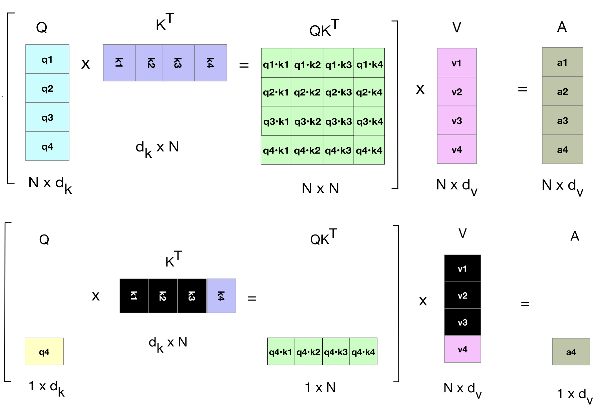 

KV cache의 작동 방식은 다음과 같다.
1. $Q, K, V$ 행렬 전체를 한 번에 계산해 $N \times N$ 크기의 거대한 $QK^T$ 행렬과 최종 출력 행렬 $A$ ($N \times d_v$)을 만든다.
2. 새로운 쿼리 벡터인 $q4$ (크기 $1 \times d_k$)만 계산한다.
3. 캐시에서 $K^T$(과거 키), $V$ (과거 밸류)를 가져온다.
4. 새로 만든 $q4$ ($1 \times d_k$)를 캐시에서 가져온 $K^T$ ($d_k \times N$)와 곱해 토큰에 대한 점수($1 \times N$)가 나온다.
5. 이 점수를 캐시에서 가져온 $V$($N \times d_v$)와 곱해 다음 문맥 벡터인 $a4$($1 \times d_v$)를 구한다.

   

## 6.12 parameter efficient finetuning (PEFT)

LLM 추가 학습을 시키면 수천억 개의 파라미터를 모두 업데이트해야 하는데, 이는 어마어마한 양의 GPU 메모리와 처리 능력, 그리고 시간이 필요하다.  
또한 모든 층에 대해 역전파(backpropagation)를 수행하는 것은 매우 비싸다.  

 

PEFT(Parameter-Efficient Finetuning)는 파라미터 효율적 미세조정이라는 뜻으로, 모델 전체를 다 학습시키지 말고 일부 파라미터만 골라서 업데이트하는 방식이다.  
모델의 대부분의 파라미터는 '동결(freeze)'시켜 업데이트되지 않도록 잠그고, 새롭게 추가된 몇 개의 파라미터 또는 기존의 일부 파라미터만 학습시킨다. 

### 6.12.1 LoRA

PEFT의 가장 대표적인 방법은 LoRA이다. LoRA는 Low-Rank Adaptation(저순위 적응)의 약자이다.  

 

Transformer는 $W^Q, W^K, W^V, W^O$ 같은 거대한 가중치 행렬을 가지고 있어 finetuning을 할 때 행렬들을 모두 업데이트하는 것은 엄청난 비용이 든다.  
원본 행렬($W$)은 동결시키고, 행렬의 '변화량($\Delta W$)'을 흉내 내는 작은 '저순위(low-rank) 근사 행렬'을 따로 만들어 이 행렬만 업데이트한다.  

 

LoRA의 작동 원리를 수식으로 살펴보자.
1. $W$를 $W + \Delta W$로 업데이트한다.
2. $W$는 동결하고($W$), $\Delta W$를 직접 계산하는 대신, $\Delta W \approx B \times A$로 흉내낸다.
    - $A$ 행렬 (크기 $N \times r$)
    - $B$ 행렬 (예: 크기 $r \times d$)
    - 여기서 $r$(rank)는 1, 2, 8처럼 아주 작은 값이다.
3. W + $\triangle W $ → W + BA 로 대체한다.
4. $h=xW$ 대신 $h=xW + xAB$ 을 계산하게 되어 효율적이다.

 

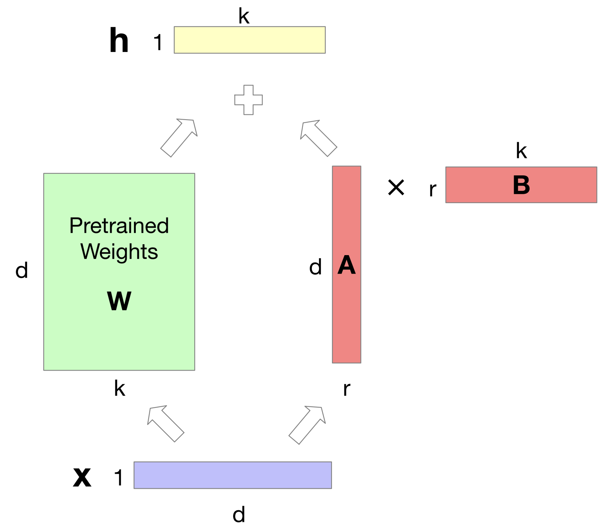 

- 경로 1: 입력 $X$가 원래 Pretrained Weights $W$ 를 통과한다.
- 경로 2: 입력 $X$가 우리가 새로 추가한 $A$ 행렬과 $B$ 행렬을 통과한다.
- 경로 1의 결과($xW$)와 경로 2의 결과($xAB$)를 서로 더해서(+) 최종 출력이 만들어진다.

 

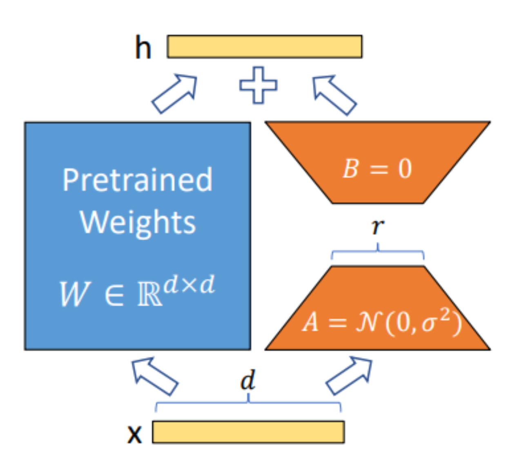 

- 경로 1: $xW$, 사전 학습된 가중치이며, 동결(frozen)되어 값이 변하지 않는다.
- 경로 2: $xAB$, $A$ 행렬과 $B$ 행렬이 학습 대상이다.
    - Matrix A = $\mathcal{N}(0, \sigma^2)$ (정규분포 초기화), 아주 작은 무작위 값들로 파라미터를 초기화한다.
    - Matrix B = 0, 모든 값이 '0'으로 초기화된다.

LoRA를 시작하는 0초 시점에는 $B$가 0이기 때문에, 새로 추가된 어댑터(경로 2)의 출력값은 무조건 0이 되어 모델의 최종 출력($h$)은 원본 모델의 출력($xW$)과 완전히 동일하다. 이는 원본 모델과 동일한 성능으로 시작한다는 의미이다.  
이후 학습이 진행되면서 $A$와 $B$의 값들이 0이 아닌 값으로 서서히 업데이트되고, 어댑터(경로 2)는 원본 모델(경로 1)의 출력을 fine-tuning 보정하는 역할을 한다.  