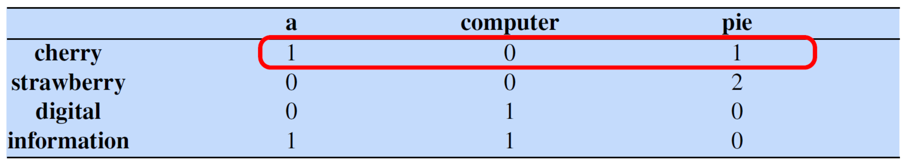
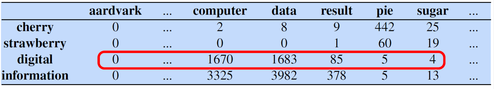
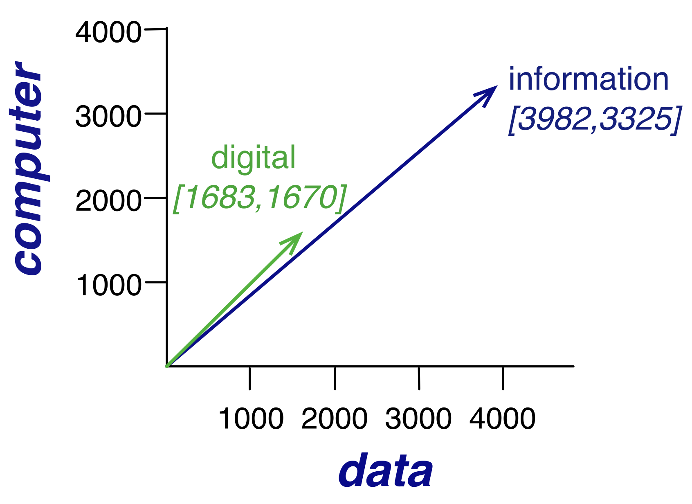
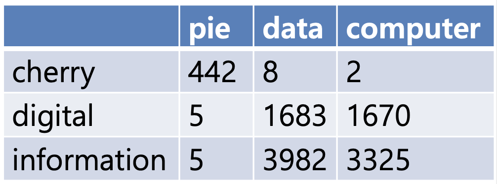
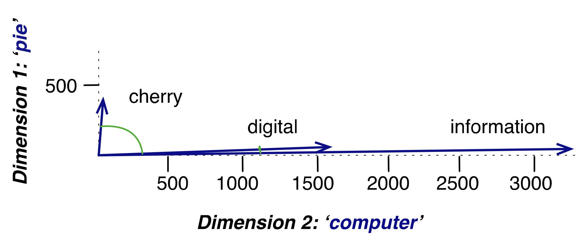
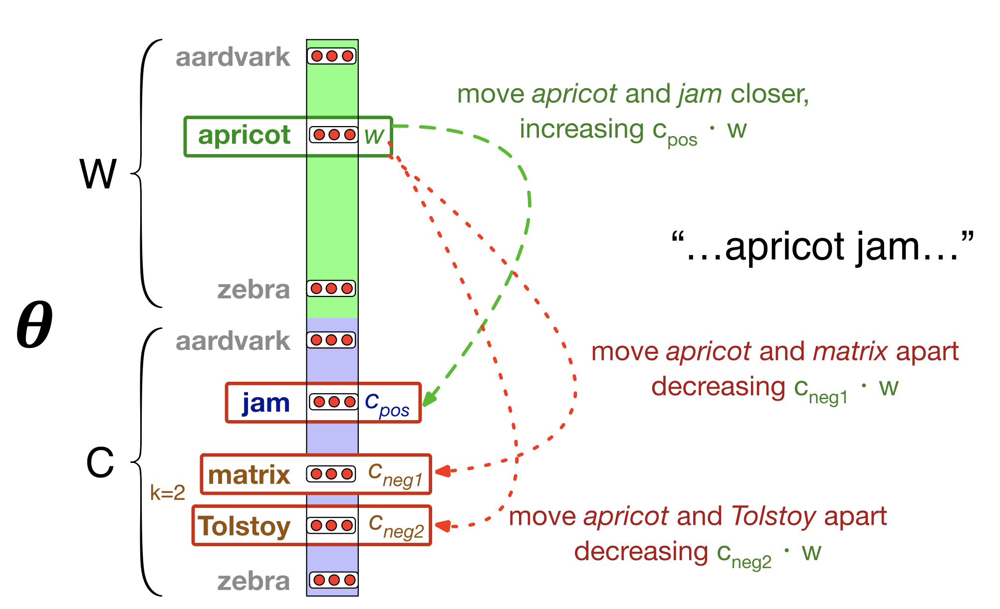

# 5. Embeddings

## 5.1 단어의 의미

단어의 의미는 매우 복잡하다.  
- 동음이의어 (Lemma and Senses): 'mouse'는 동물 '쥐'일 수도, 컴퓨터 '마우스'일 수도 있다.
- 단어 간의 관계 (Relations):
    - 유의어 (Synonymy): 뜻이 거의 같은 단어들 (couch / sofa) 
    - 유사성 (Similarity): 완전히 같진 않지만 비슷한 부류의 단어들 (car / bicycle) 
    - 연관성 (Relatedness): 의미는 다르지만 서로 연관된 단어들 (coffee / cup) 
    - 반의어 (Antonymy): 반대되는 의미, 하나의 특징만 반대되고 나머지는 유사함 (hot / cold)
    - 함의 (Connotation): 단어가 주는 느낌이나 감정 (happy는 긍정적, sad는 부정적)
        - Valence (유가): 얼마나 즐거운지 (쾌/불쾌) - love는 긍정 수치가 높고, toxic은 긍정 수치가 낮음
        - Arousal (각성): 감정이 얼마나 강렬한지 (흥분/차분) - frenzy는 매우 강렬, napping은 매우 차분
        - Dominance (우세): 얼마나 통제력이 강하게 느껴지는지 (지배/종속) - powerful(강력한)은 지배력이 높지만, weak(약한)은 낮음

이렇게 복잡한 단어의 의미와 관계들을 컴퓨터가 이해할 수 있는 모델로 만들기 위해 __벡터 의미론 (Vector Semantics)__ 으로 단어의 의미를 벡터로 표현한다. 

 

## 5.2 단어의 의미 표현

어떤 단어의 의미는 그 언어에서 그 단어의 쓰임새이다. 그리고 단어의 쓰임새란 그 단어의 환경, 즉 주변에 오는 단어들이다. 

예를 들어, 처음 보는 단어 "ongchoi"의 뜻을 유추해보자. 다음과 같은 문장들이 있다.
- 'ongchoi'는 마늘과 함께 볶으면 맛있다.
- 'ongchoi'는 밥 위에 올려 먹으면 훌륭하다.
- 'ongchoi' 잎과 짠 소스.

이런 문장들을 통해 'ongchoi'가 '시금치 같은 잎채소'일 것이라고 추측할 수 있다. 이는 단어의 정의를 몰라도 주변 단어들을 통해 의미를 알 수 있다는 것을 뒷받침한다. 

 

여기서 단어를 표현하는 방법이 등장한다.  

아이디어 1: 단어의 의미는 분포, 즉 주변 단어에 있다.  
아이디어 2: 단어의 의미는 함의의 세 요소(Valence, Arousal, Dominance)를 이용한 벡터로 표현할 수 있다.  

이 두 아이디어를 합친 것이 바로 __워드 임베딩(Word Embedding)__ 의 핵심이다.  

 

## 5.3 임베딩

__임베딩 (Embedding)__: 단어의 의미를 벡터로 표현하는 것  
의미가 비슷한 단어들은 의미 공간(semantic space)에서 서로 가까이에 위치한 벡터로 나타난다.  
단어를 훈련 때 본 적이 없더라도, 벡터가 비슷하다는 것만으로 유사한 의미로 일반화(generalize) 할 수 있다.  

 

벡터(임베딩)를 만드는 구체적인 방법은 2가지가 있다.
1. 단순 count 임베딩
    - 희소 벡터 (Sparse vectors)
    - 단어 주변에 어떤 단어가 몇 번 등장했는지 횟수를 세서 만든다.
    - tf-idf 모델로 발전
2. Word2vec
    - 밀집 벡터 (Dense vectors)
    - 어떤 단어가 주변에 나타날지 예측하는 분류기를 훈련시켜서 만든다.
    - BERT와 같은 문맥적 임베딩으로 발전

 

## 5.3.1 count embedding

단어의 이웃(neighborhood)을 측정하기 위해 Word-Context Matrix(단어-문맥 행렬) 표를 만든다.  
이 표의 각 행(row)은 어휘 사전의 모든 단어, 각 열(column)은 단어의 주변에 다른 단어들이 등장한 횟수를 나타낸다.  
이웃을 결정하기 위한 범위를 문맥 창(context window)이라고 부른다.  

 

예시를 통해 이해해보자. 다음과 같은 4개의 문장이 있고, 문맥 창은 4단어 이내이다.  
- "... traditionally followed by cherry pie, a traditional dessert"
- "... such as strawberry rhubarb pie. Apple pie"
- "... peripherals and personal digital assistants. These devices..."
- "... a computer. This includes information available on the..."

 
 

예시 문장들로 작은 행렬을 만든 것이다. 칸에는 행에 있는 단어가 열에 있는 단어와 4단어 이내에서 만난 횟수를 채운다. 
각 행은 단어의 벡터를 나타내며, 이 벡터는 다른 모든 단어와 함께 등장한 횟수를 가지고 있다. 
더 많은 데이터로 행렬을 채워보자. 

 
 

cherry와 strawberry가 'pie', 'sugar' 열에서 높은 값을 갖고, digital과 information은 'computer', 'data' 열에서 높은 값을 갖는다.  
즉, 비슷한 단어들은 비슷한 벡터(행)를 갖게 됩니다.  
이 벡터를 2차원 그래프로 그려서 시각화해보자. 

 
 

두 단어의 벡터(화살표)가 원점(0,0)에서 거의 같은 방향을 가리키는 것을 볼 수 있다.  
이는 두 단어가 매우 유사한 문맥에서 사용된다는 것, 즉 의미가 비슷하다는 것을 나타낸다.  
하지만 Word context matrix의 대부분은 값이 0인 희소 벡터이다.  

 

벡터 간 유사도는 수학적으로 내적(Dot product)을 이용해 계산한다.
내적이란 두 벡터가 있을 때, 같은 차원(같은 열)에 있는 값끼리 곱한 뒤, 그 값들을 모두 더하는 것이다.
공식으로는 $dot product(v, w) = v_1w_1 + v_2w_2 + \dots + v_Nw_N$ 로 나타낼 수 있다.
두 벡터가 같은 차원에서 둘 다 큰 값을 가지고 있을수록 내적 값은 높아지므로 유사도를 측정하는 지표로 사용할 수 있다.

 

하지만 내적은 긴 벡터에 편향되어 있다. 
벡터의 길이는 $|v| = \sqrt{\sum v_i^2}$ 처럼 각 차원의 값을 제곱해서 더한 뒤 루트를 씌워서 계산한다. 
긴 벡터는 벡터의 크기가 긴 것을 말하는데, 'the', 'you'처럼 자주 쓰이는 단어들이 긴 벡터를 가진다. 
내적을 사용하면 어떤 단어가 'the'와 의미가 비슷하지 않아도 'the'의 벡터가 길어서 내적 값이 높게 나올 수 있다. 
즉, 의미의 유사성이 아니라 단순히 등장 빈도 때문에 점수가 높아지는 왜곡이 발생한다. 

### 5.3.2 Cosine Similarity

두 벡터의 길이(크기)는 무시하고, 순수하게 방향이 얼마나 비슷한지 확인하기 위해 코사인 유사도를 사용한다. 
두 벡터의 내적($\vec{v} \cdot \vec{w}$)을 각 벡터의 길이($|\vec{v}|$와 $|\vec{w}|$)의 곱으로 나눈다. 
이 공식은 두 벡터 사이의 각도($\theta$)에 대한 코사인 값을 계산하는 것과 같다.($\cos \theta = \frac{\vec{a} \cdot \vec{b}}{|\vec{a}| |\vec{b}|}$)  
코사인 유사도는 벡터의 길이를 1로 표준화한 뒤에 내적을 구하는 것과 같아 긴 벡터의 영향력이 제거되고, 방향의 유사성만 비교할 수 있다.  
코사인 유사도의 의미는 다음과 같다.
- +1: 두 벡터가 완전히 같은 방향을 가리킴. (각도 $0^\circ$) = 의미가 완벽하게 동일함
-  0: 두 벡터가 서로 직각($90^\circ$) = 의미적으로 아무 관련 없음
- -1: 두 벡터가 완전히 반대 방향을 가리킴. (각도 $180^\circ$) = 의미가 완벽하게 반대됨

단어-문맥 행렬은 등장 횟수를 세는 것이라 모든 값이 0 또는 양수이므로 코사인 값도 0에서 1 사이의 값만 갖는다. 

 

 
위의 행렬을 이용해서 코사인 유사도를 계산해보자. 
코사인 유사도의 공식은 다음과 같다. 

$$
\text{cos}(\vec{v}, \vec{w}) =
\frac{\vec{v} \cdot \vec{w}}{|\vec{v}| |\vec{w}|} =
\frac{\sum_{i=1}^{N} v_i w_i}{
\sqrt{\sum_{i=1}^{N} v_i^2} \sqrt{\sum_{i=1}^{N} w_i^2}
}
$$

분자 ($\sum v_{i}w_{i}$)는 두 벡터의 내적으로, 같은 차원의 값끼리 곱해서 모두 더한 값이다. 
분모 ($\sqrt{\sum v_{i}^{2}}\sqrt{\sum w_{i}^{2}}$)는 두 벡터의 길이를 각각 구해서 곱한 값이다. 

cos(cherry, information)를 계산해보자. 
- $\vec{v} \text{ (cherry)} = [442, 8, 2]$
- $\vec{w} \text{ (information)} = [5, 3982, 3325]$

계산식: $\text{cos}(\vec{v},\vec{w}) = \frac{(442 \times 5) + (8 \times 3982) + (2 \times 3325)}{\sqrt{442^2 + 8^2 + 2^2} \times \sqrt{5^2 + 3982^2 + 3325^2}}$
 
결과는 0.017로 0에 매우 가깝다. 이는 두 벡터가 가리키는 방향이 거의 90도에 가깝다는 뜻이며, 두 단어의 사용 문맥이 매우 다르다는 의미이다. 

 

cos(digital, information)를 계산해보자. 
- $\vec{v} \text{ (digital)} = [5, 1683, 1670]$
- $\vec{w} \text{ (information)} = [5, 3982, 3325]$

계산식: $\text{cos}(\vec{v},\vec{w}) = \frac{(5 \times 5) + (1683 \times 3982) + (1670 \times 3325)}{\sqrt{5^2 + 1683^2 + 1670^2} \times \sqrt{5^2 + 3982^2 + 3325^2}}$
 
결과는 0.996로 1에 매우 가깝다. 이는 두 벡터가 가리키는 방향이 거의 0도에 가깝다는 뜻이며, 두 단어의 사용 문맥이 거의 동일하다는 의미이다. 

 

 
코사인 유사도를 그래프로 시각화한 것이다. x축은 computer와 등장한 횟수, y축은 pie와 등장한 횟수를 나타낸다.  
cherry는 pie와 가리기는 방향이 유사하고, digital과 information은 computer와 가리키는 방향이 유사한 것을 확인할 수 있다.  

 

## 5.4 sparse vs. dense vectors

- Sparse vector
    - tf-idf 등으로 가중치를 준 카운트 기반 벡터
    - 벡터의 차원(길이)이 사전의 단어 수(V)와 같음 = 길이가 긺
    - sparse: 대부분의 값이 0
- Dense vector
    - 50~1000차원 정도로 우리가 정하기 나름 = 길이가 짧음
    - dense: 대부분의 값이 0이 아닌 실수

 

Dense Vector를 사용하는 이유
- 벡터가 짧으면(차원이 낮으면) 기계 학습 모델이 튜닝해야 할 가중치(파라미터) 수가 적어져서 더 효율적으로 학습이 가능함
- 단순 횟수보다 일반화 성능이 더 좋을 수 있음
- 유의어 포착에 탁월
    - 카운트 벡터에서는 유의어를 서로 다른 차원으로 취급해 유의어의 유의어끼리 연결하지 못함
    - 밀집 벡터는 벡터들의 거리 자체가 가깝기 때문에 유의어끼리 모임

 

Dense Vector를 만드는 방법
- 신경망 언어 모델 기반: Word2vec이나 Glove 같은 모델을 사용함
- 특이값 분해 (SVD): 카운트 벡터를 SVD로 분해하여 밀집 벡터만 추출하는 방식, 잠재 의미 분석 (LSA)이라고도 부름
- 문맥적 임베딩 (Contextual Embeddings): Word2vec이나 SVD는 정적 임베딩이므로 하나의 벡터 값을 가짐, BERT 같은 최신 모델들은 문맥적 임베딩을 사용해 문장 속에서 단어가 사용된 문맥에 따라 동적으로 다른 벡터를 계산함

 

## 5.5 Word2Vec

Word2vec는 밀집 벡터(dense vector)를 만드는 방법 중 하나이다. 
단어 횟수를 세는 대신, 단어의 등장을 예측하는 방식으로 접근한다. 여기서는 Word2vec 방식 중 하나인 skip-gram with negative sampling (SGNS) 모델에 대해서 살펴본다. 

 

Word2vec는 분류기(classifier), 즉 예측 기계를 하나 만든다.  
이 기계에 "apricot"이라는 단어를 줬을 때, "jam"이라는 단어가 그 근처에 나타날 가능성이 높은지 예측하도록 훈련시킨다.  
예측 기계의 최종 예측 결과(O/X)보다는 이 기계가 예측을 잘하기 위해 내부적으로 학습한 '가중치(weights)'가 중요하다. 이 가중치 값들이 바로 단어 임베딩(벡터)가 된다.  
이 방식은 자기-지도 학습 (Self-supervision)으로 진행되기 때문에 사람이 개입할 필요가 없다.  
Word2vec은 훈련을 통해 W 행렬 (Target embeddings, 문장의 중심(타겟) 단어일 때 사용되는 벡터), C 행렬 (Context embeddings, 주변(문맥) 단어일 때 사용되는 벡터)를 얻고자 한다. 
훈련이 끝나면 apricot이라는 단어는 타겟 벡터 $w_{\text{apricot}}$과 문맥 벡터 $c_{\text{apricot}}$ 두 개를 갖게 된다. 임베딩으로는 두 벡터를 더해서 사용하는 것이 일반적이다.  

 

Word2vec을 훈련시킬 때 이웃으로 간주하는 문맥 창의 크기($C$)를 어떻게 설정하느냐에 따라, 임베딩이 학습하는 유사성의 종류가 달라진다.  
작은 문맥 창(Small window, 예: $C=\pm2$)의 경우, 문법적으로 비슷하거나(예: 같은 품사) 분류상 매우 가까운 단어들을 이웃으로 학습한다.  
큰 문맥 창 (Large window, 예: $C=\pm5$)의 경우, 문법적으로는 다르더라도, 같은 주제나 의미 영역에 속하는 단어들을 이웃으로 학습한다.  
Hogwarts를 예시로 들면 작은 문맥 창으로 학습할 경우 Sunnydale, Evernight와 같은 '학교' 이름들을 학습하고, 큰 문맥 창으로 학습한 경우 같은 주제(해리 포터)에 속하는 단어들인 Dumbledore, Malfoy 등을 학습한다.  

 

Word2vec의 훈련 방식은 다음과 같다.
1. 긍정 예시 (Positive examples): 훈련 텍스트에서 실제 타겟 단어(t)와 그 이웃 단어(c)를 가져온다. (예: (apricot, jam))
2. 부정 예시 (Negative examples): 사전에서 아무 상관 없는 단어를 무작위로 뽑아 타겟 단어와 짝짓는다. (예: (apricot, aardvark))
3. 로지스틱 회귀 분류기를 사용하여, 1번(긍정 예시)과 2번(부정 예시)을 구별하도록 훈련시킨다.
4. 훈련이 끝나면 분류기는 버리고, 훈련된 가중치만 꺼내서 단어 임베딩(벡터)으로 사용한다.

### 5.5.1 Skip-Gram 모델

Skip-Gram 분류기에 대해서 정리해보자.
- 입력
    - 타겟 단어 $w$ (예: apricot)
    - $w$의 실제 문맥 단어 목록 $c_{1:L}$ (예: tablespoon, of, jam...)
- 출력
    - $w$가 이 문맥 단어들 $c_{1:L}$ 사이에서 나타날 확률
- 작동 원리
    - $w$의 임베딩(벡터)과 $c_{1:L}$의 임베딩(벡터)들 사이의 유사도를 기반으로 확률을 계산함

따라서 skip-gram 분류기가 잘 작동하기 위해서는 모든 단어의 임베딩(벡터)을 가지고 있어야 한다.  

 

예시를 통해 Skip-Gram 모델을 이해해보자.  
- 문장: ... lemon, a [tablespoon of apricot jam, a] pinch...
- 문맥 창(Window): +/- 2 단어 (즉, 타겟 단어의 앞 2개, 뒤 2개)
- 타겟 단어 (Target): apricot
- 문맥 단어 (Context): tablespoon (c1), of (c2), jam (c3), a (c4)
- 긍정 예시: (apricot, tablespoon), (apricot, of), (apricot, jam), (apricot, a)

 

만든 데이터로 분류기를 훈련시켜 보자. 분류기는 (단어, 문맥) 한 쌍을 입력으로 받아 각 쌍에 대해 이것이 실제 이웃일 확률을 계산한다.
- (긍정): (apricot, jam) - $P(+|w, c)$ : w와 c가 실제 이웃일 확률, 1에 가까워야 함
- (부정): (apricot, aardvark) - $P(-|w, c)$ : w와 c가 실제 이웃이 아닐 확률, 0에 가까워야 함

 

두 벡터가 얼마나 유사한지는 내적으로 계산할 수 있다. 하지만 내적 값은 확률이 아니기 때문에 이를 처리하기 위해 __시그모이드(Sigmoid)__ 함수를 사용한다.  
긍정 확률 $P(+|w,c)$ = $\sigma(c \cdot w) = \frac{1}{1+exp(-c \cdot w)}$, 내적 값이 크면 결과가 1에 가까워진다.  
부정 확률 $P(-|w,c)$ = 1 - $P(-|w,c)$ = $\sigma(-c \cdot w) = \frac{1}{1+exp(c \cdot w)}$, 내적 값이 크면 결과가 0에 가까워진다.  

 

지금까지는 (단어, 문맥) 한 쌍에 대한 계산이었다. 그렇다면 여러 개의 문맥 단어에 대해서는 어떻게 계산할까?  
모든 문맥 단어는 서로 독립적이라고 가정하면, 모든 문맥 단어의 긍정 확률을 전부 곱해서 구할 수 있다.  

$$
P(+|w,c_{1:L}) = \prod_{i=1}^{L}\sigma(c_{i}\cdot w)
$$

컴퓨터는 곱하기보다 더하기를 잘하기 때문에 실제로는 확률에 로그를 씌워서 곱셈을 덧셈으로 바꿔서 계산한다. 이때의 공식은 다음과 같다.  

$$
log~P(+|w,c_{1:L}) = \sum_{i=1}^{L}log~\sigma(c_{i}\cdot w)
$$

 

Negative Sampling 기법을 이용해 부정 예시를 만들어보자. 타겟 단어(apricot)는 그대로 두고 , 사전에서 아무 상관 없는 단어를 무작위로 뽑아와 짝을 짓는다.  
(apricot, aardvark), (apricot, my), (apricot, where), (apricot, coaxial) 등의 부정 예시가 만들어졌다.  
Word2vec의 훈련의 목표는 모든 단어 벡터($W$와 $C$)를 조금씩 조정해서 긍정 예시($c_{pos}$) 쌍의 유사도는 최대화하고, 부정 예시($c_{neg}$) 쌍의 유사도는 최소화하는 것이다.  

### 5.5.2 손실 함수

학습 과정에서 손실은 현재 모델이 얼마나 틀렸는지를 나타내는 점수이며, 손실 값을 최소화시키는 것이 목적이다.  
이를 달성하기 위해서는 긍정 예시($c_{pos}$)의 확률($P(+|w,c_{pos})$)은 최대화, 부정 예시($c_{neg_i}$)의 "아닐 확률"($P(-|w,c_{neg_i})$)도 최대화해야 한다.  
확률 $P$를 1로 만드는 것은 손실 $-log(P)$를 0으로 만드는 것과 동일하고 컴퓨터는 log 계산이 더 빠르기 때문에 -log를 최소화하는 방식을 사용한다.  

$$
L_{CE} = -log[P(+|w,c_{pos}) \times \prod_{i=1}^{k} P(-|w,c_{neg_i})]
$$

모델의 전체 확률은 모든 개별 확률을 곱한 것이다.우리의 목표는 전체 확률을 최대화하는 것이다.  
$log(a \times b) = log(a) + log(b)$를 이용해 곱셈 $\prod$을 덧셈 $\sum$으로 바꾼다.

$$
L_{CE} = -[log~P(+|w,c_{pos}) + \sum_{i=1}^{k} log~P(-|w,c_{neg_i})]
$$

$P(-|w,c_{neg_i})$는 $1 - P(+|w,c_{neg_i})$와 같다.  
또한 $P(+|w,c) = \sigma(c \cdot w)$ 이고 $P(-|w,c) = \sigma(-c \cdot w)$ 이다.  
이를 전부 적용하면 손실 함수를 다음과 같은 공식으로 정리할 수 있다.  

$$
L_{CE} = -[log~\sigma(c_{pos}\cdot w) + \sum_{i=1}^{k} log~\sigma(-c_{neg_i}\cdot w)]
$$

 

손실($L_{CE}$) 값을 최소화하기 위해 __확률적 경사 하강법 (Stochastic Gradient Descent, SGD)__ 을 사용한다.  
경사 하강법은 함수의 값이 낮아지는 방향으로 독립변수들의 값을 변형시키면서 함수가 최소값을 갖도록 하는 독립변수를 찾는 방식이다.  
산 중턱에서 가장 낮은 지점(손실(Loss)이 0인 지점)으로 이동하는 방식이라고 이해해도 좋다.  
경사 하강법은 2단계를 이용해 문제를 해결한다.
1. 방향(Direction) 정하기: 기울기(Gradient)의 정반대 방향으로 이동
2. 보폭(Magnitude) 정하기: 학습률(learning rate, $\eta$) 만큼 이동

 

$$
w^{t+1} = w^{t} - \eta \frac{d}{dw}L(f(x;w),y)
$$

경사 하강법을 공식으로 표현하면 다음과 같다.
- $w^{t+1}$: 업데이트된 벡터 값(가중치)
- $w^{t}$: 현재 벡터 값
- $L$: 손실 함수, 손실 함수의 값을 최소화(0)하는 것이 목표
- $\frac{d}{dw}L$: 기울기, 손실 함수 $L$을 현재 $w$로 미분한 값으로, 현재 위치($w^t$)에서 손실($L$)이 가장 가파르게 증가하는 방향
- $\eta$: 학습률, 이동 크기

 

 
위의 사진으로 설명해보자. 다음과 같은 예시들이 있다.  
(apricot, jam) (긍정) / (apricot, matrix) (부정) / (apricot, Tolstoy) (부정)  
긍정 예시는 손실을 줄이기 위해 둘의 유사도를 높여야 하므로 $w_{\text{apricot}}$ 벡터와 $c_{\text{jam}}$ 벡터를 가깝게 이동한다.  
부정 예시는 손실을 줄이기 위해 둘의 유사도를 낮춰야 하므로 $w_{\text{apricot}}$ 벡터를 $c_{\text{matrix}}$와 $c_{\text{Tolstoy}}$ 벡터로부터 멀리 이동한다.  

### 5.5.3 기울기

손실 함수($L_{CE}$)를 미분해서 기울기($\frac{d}{dw}L$)를 구하면 3개의 공식을 얻을 수 있다.  

$$
\frac{\partial L_{CE}}{\partial c_{pos}} = [\sigma(c_{pos}\cdot w)-1]w
$$

긍정 문맥 벡터($c_{pos}$)를 업데이트할 방향을 의미한다.  
$\sigma(c_{pos}\cdot w)$ 는 현재 $c_{pos}$와 $w$의 유사도를 의미하고, 우리의 목표는 이 값이 1이 되는 것이다.  
$\sigma(c_{pos}\cdot w)$ -1은 항상 음수이므로 이 값의 반대 방향으로 이동하면 $c_{pos}$는 $w$ 벡터와 가까워진다.  

 

$$
\frac{\partial L_{CE}}{\partial c_{neg}} = [\sigma(c_{neg}\cdot w)]w
$$

부정 문맥 벡터($c_{neg}$)를 업데이트할 방향을 의미한다.  
$\sigma(c_{neg}\cdot w)$ 는 현재 $c_{neg}$와 $w$의 유사도를 의미하고, 우리의 목표는 이 값이 0이 되는 것이다.  
$\sigma(c_{neg}\cdot w)$ 는 항상 양수이므로 이 값의 반대 방향으로 이동하면 $c_{neg}$는 $w$ 벡터와 멀어진다. 

 

$$
\frac{\partial L_{CE}}{\partial w} = [\sigma(c_{pos}\cdot w)-1]c_{pos}+\sum_{i=1}^{k}[\sigma(c_{neg_{i}}\cdot w)]c_{neg_{i}}
$$

타겟 단어 벡터($w$)를 업데이트할 방향을 의미한다.  
위의 긍정 문맥 벡터와 부정 문맥 벡터 공식을 합친 것으로, 타겟 단어 $w$는 긍정 벡터($c_{pos}$) 쪽으로 끌어당겨지는 힘과 $k$개의 모든 부정 벡터들($c_{neg_i}$)로부터 밀려나는 힘을 동시에 받아 모든 힘의 총합만큼 $w$ 벡터가 움직인다. 

 

위의 공식을 바탕으로 확률적 경사 하강법(SGD) 공식 $w^{t+1} = w^{t} - \eta \times (\frac{\partial L}{\partial w})$을 업데이트해보자.  

$$
c_{pos}^{t+1}=c_{pos}^{t}-\eta[\sigma(c_{pos}^{t}\cdot w^{t})-1]w^{t}
$$

경사 하강법 공식에 $c_{pos}$ 기울기 공식을 대입한 것이다.  
$c_{pos}$는 $w$ 벡터의 같은 방향(+)으로 움직인다.  

$$
c_{neg}^{t+1}=c_{neg}^{t}-\eta[\sigma(c_{neg}^{t}\cdot w^{t})]w^{t}
$$

경사 하강법 공식에 $c_{neg}$ 기울기 공식을 대입한 것이다.  
$c_{nex}$는 $w$ 벡터의 반대 방향(-)으로 움직인다.  

$$
w^{t+1}=w^{t}-\eta[[\sigma(c_{pos}\cdot w^{t})-1]c_{pos}+\sum_{i=1}^{k}[\sigma(c_{neg_{i}}\cdot w^{t})]c_{neg_{i}}]
$$

경사 하강법 공식에 $w$ 기울기 공식을 대입한 것이다.  
타겟 단어 $w$는 긍정 벡터($c_{pos}$) 쪽으로 끌어당겨지는 힘과 $k$개의 모든 부정 벡터들($c_{neg_i}$)로부터 밀려나는 힘을 동시에 받아 모든 힘의 총합만큼 $w$ 벡터가 움직인다. 

## 5.6 Analogical Relations

임베딩 벡터들이 단순한 유사성(가까움/멂)뿐만 아니라, 단어 간의 관계 자체를 벡터의 방향으로 학습한다.  
apple에서 tree로 가는 벡터는 "열매가 자라는 곳"이라는 관계 벡터를 나타낸다. 이 관계 벡터는 grape에서 vine으로 가는 벡터와 거의 평행하고 길이가 같다.  
"apple is to tree as grape is to ___" 라는 문장이 주어졌을 때, `vector('grape') + (vector('tree') - vector('apple'))`를 계산하면 정답인 `vector('vine')`에 도달한다.  

 

$$
b^\* = \arg\max \, \text{distance}(x, a^\* - a + b)
$$

공식으로 일반화시키면 다음과 같다.  
이는 $a:a^\* :: b:b^\*$ 문제를 풀 때, 정답 $b^\*$는 $a^\* - a + b$ 벡터와 가장 가까운 단어 $x$라는 의미이다.  
평행사변형(유추) 방식은 모든 경우에 작동하지는 않고, 주로 자주 사용되는 단어들과 특정 관계(수도-나라, 품사)에 대해서만 잘 작동한다.  

 

임베딩을 통해 시간이 지남에 따라 단어의 의미가 어떻게 변했는지, 문화적 편견이 시간에 따라 어떻게 변했는지 추적할 수 있다.  
또한, 임베딩은 사람이 쓴 텍스트로부터 학습하기 때문에 텍스트에 인종차별이나 성차별 같은 문화적 편견이 담겨 있다면, 임베딩도 그 편견을 그대로 학습한다.  
`man : computer programmer :: woman : x` $\rightarrow$ `x = homemaker`와 같은 편향된 임베딩을 프로그래머 채용 AI에 사용한다면, AI가 여성 지원자에게 불이익을 주는 불공정한 결정을 내릴 수 있다.  