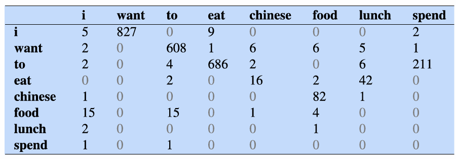

# 2. N-gram Language Modeling

## 2.1 언어 모델이란 무엇일까?

__언어 모델(Language Model)__ 이란 기본적으로 다음에 올 단어를 예측하는 기계 학습 모델이다.
언어 모델 패러다임에는 N-gram language model과 Large language model(LLM)이 있다.

언어 모델의 목표는 단순히 단순히 다음 단어를 맞추는 것을 넘어, 문장 전체의 자연스러움을 확률로 계산하는 것이다.

## 2.2 문장의 확률 계산: Chain Rule

문장 전체의 확률 $P(W)$는 $P(w_1, w_2 ,w_3,...,w_n)으로 나타낸다.

다음에 올 단어의 확률 $P(W_n)$은 $P(w_n|w_1, w_2,...,w_{n−1})$로 나타낸다.
이 공식은 $w_1$부터 $w_{n-1}$까지의 단어들이 주어졌을 때, 다음 단어가 $w_n$일 조건부 확률을 의미한다.

언어 모델이란 이 두 가지 종류의 확률($P(W)$ 또는 $P(w_n|w_1, w_2,...,w_{n−1})$ 중 하나를 계산하는 모델이라고 할 수 있다.

하지만 세상에는 무수히 많은 문장이 존재하므로 특정 문장이 나타날 확률을 계산하기 위해 그 문장이 얼마나 자주 등장했는지 세는 것은 불가능에 가깝다.

이 문제를 해결하기 위해 __확률의 연쇄 법칙 (Chain Rule)__ 을 사용한다.
연쇄 법칙은 문장 전체의 확률을 한 번에 구하는 대신, 각 단어의 확률을 단계별로 곱해나가는 방식이다.

조건부 확률은 $P(B|A) = P(A,B) / P(A)$로 나타낼 수 있고, 이를 두 사건 A와 B가 함께 일어날 확률 $P(A,B)$를 P(B|A) * P(A)$로 변형 가능하다.

이를 4개의 사건(A, B, C, D)에 대해 $P(A, B, C, D) = P(A) * P(B|A) * P(C|A, B) * P(D|A, B, C)$와 같이 확장할 수 있다. 즉, 첫 번째 사건의 확률부터 시작해서, 이전 사건들이 모두 일어났다는 조건 하에 다음 사건이 일어날 확률을 계속해서 곱해나가는 것이다.

이를 일반화하면 다음과 같은 연쇄 법칙 공식이 완성된다. 
$P(x_1,x _2​,...,x _n​) = P(x_1)P(x_2​∣x_1​)P(x_3​∣x_1,x_2)...P(x_n​∣x_1,...,x_{n−1}$)
  
> The water of Walden Pond is so beautifully blue.  

위의 문장을 chain rule을 통해 분석해보자.

$P(W) = P(The, water, of, Walden, Pond, is, so, beautifully, blue)$ 이다.

chain rule을 적용하면 $P(The water or Walden Pond) = P(The) * P(water|the) * P(of|The water) * P(Walden|The water of) * P(Pond|The water of Walden)$으로 나타낼 수 있다.

## 2.3 단순화: 마르코프 가정

이렇게 chain rule을 적용한다고 하더라도, $P(blue|The water of Walden Pond is so beautifully)$를 계산하기 위해서는 그 문장이 나온 모든 경우를 알아야 하기 때문에 문제가 발생한다. (2.2 참고)

__마르코프 가정(Markov Assumption)__ 은 다음에 올 단어는 바로 직전의 몇 개 단어에만 영향을 받는다는 가정이다. 모든 과거를 기억하는 대신, 최근 N개의 단어만 기억하는 일종의 단기 기억 전략이다.
수식으로 표현하면 $P(w_n|w_{1:n-1}) ≈ P(w_n|w_{n-N+1:n-1})$이다.

이 'N'을 몇 개로 하느냐에 따라 N-gram 모델의 종류가 나뉜다.

## 2.4 N-gram 모델의 종류

N-gram에서 'gram'은 단어를, 'N'은 몇 개의 단어를 묶어서 보는지(기억의 범위)를 의미한다.
- 유니그램 (Unigram, 1-gram)
    - N=1
    - $P(w_1w_2...w_n) ≈ P(w_1)P(w_2)...P(w_i)$
- 바이그램 (Bigram, 2-gram)
    - N=2, 바로 앞 단어 1개만 기억
    - $P(w_i | w_{i-1})$

N-gram 모델의 한계는 다음과 같다.
1. 장거리 의존성 문제: 멀리 떨어진 단어의 관계를 파악하기 어려움
2. 새로운 데이터 문제: 학습 데이터에 등장하지 않은 단어 조합이 나오면 계산 결과가 나쁨
이에 대한 해결책으로 embedding space를 이용해 긴 문맥을 잘 학습하는 **Large Language Model**이 사용된다.

## 2.5 N-gram 모델의 확률 계산

N-gram 모델의 확률은 __최대우도추정 (Maximum Likelihood Estimate, MLE)__ 을 통해 계산된다.  
MLE는 우리가 가진 데이터(Corpus)에서 가장 많이 관찰된(빈도가 높은) 패턴이 실제로 일어날 확률이 가장 높을 것이라고 가정하는 방식이다.

- $P(w_n∣w_{n−1})$: 단어 $w_{n−1}$ 다음에 단어 $w_n$이 나올 확률
- $C(w_{n−1}​w_n))$: 전체 데이터에서 두 단어 $w_{n-1}$와 $w_n$가 연달아 나온 횟수(Count)
- $C(w_{n−1})$: 전체 데이터에서 앞 단어($w_{n−1}$)가 총 등장한 횟수
즉, "A 다음에 B가 나올 확률 = (A B가 연달아 나온 횟수) / (A가 총 나온 횟수)" 로 계산하는 것이다.
  

> &lt;s&gt; I am Sam &lt;/s&gt;  
> &lt;s&gt; Sam I am &lt;/s&gt;  
> &lt;s&gt; I do not like green eggs and ham &lt;/s&gt;

위와 같은 데이터(corpus)가 있을 때 몇 가지 확률을 계산해보자.

$P(I|<s>)$, 문장이 시작(&lt;s&gt;)된 후 'I'가 나올 확률을 계산해보자. 
문장의 시작(&lt;s&gt;)은 총 3번 있었으므로 $C(<s>) = 3$, &lt;s&gt; 다음 I가 나온 횟수는 2번이므로 $C(<s>,I) = 2$이다.  
따라서 확률은 2/3 = 0.67이다.

실제 연구에 사용되었던 Berkeley Restaurant Project의 데이터를 통해 N-gram 모델의 확률을 계산해보자.

위의 이미지는 9,222개의 문장 데이터에서, 어떤 단어 뒤에 어떤 단어가 몇 번 나왔는지를 표로 정리한 것이다.
가로줄(row)의 단어가 먼저 나오고, 세로줄(column)의 단어가 뒤따르는 경우의 횟수이다.

각 단어가 총 몇 번 등장했는지(unigram count)를 확인한 후, `바이그램 횟수 / 유니그램 횟수`로 계산하면 확률을 구할 수 있다.

완성된 바이그램 확률표를 이용해 새로운 문장의 전체 확률을 계산할 수 있다.  
"I want english food"의 확률을 계산하고 싶다면 연쇄 법칙을 이용해 다음과 같이 계산할 수 있다.  
$P(<s> I want english food </s>)=P(I∣<s>)×P(want∣I)×P(english∣want)×P(food∣english)×P(</s>∣food)$

N-gram을 통해 다음과 같은 지식을 학습할 수 있다.
- 문법 지식: 'want' 다음에는 'to'가 올 확률이 높다는 것을 학습함
- 의미 지식: 'dinner'나 'lunch' 같은 단어는 비슷한 문맥에서 사용된다는 것을 파악함
- 현실 지식: 데이터 안에서 "Chinese food"가 "English food"보다 더 자주 언급된다면, 전자의 확률을 더 높게 평가해 현실 세계의 인기도를 반영함  
 

확률은 0과 1 사이의 작은 수라서 계속 곱하면 컴퓨터가 0으로 처리해버리는 '언더플로우' 문제가 생길 수 있다. 이를 방지하기 위해 확률에 로그를 씌워서 곱셈을 덧셈으로 바꿔 계산의 안정성을 높인다.

## 2.6 Larger N-gram

4-gram, 5-gram처럼 N의 크기를 키울수록 더 자연스러운 문맥을 학습할 수 있지만 미리 계산하고 저장해야 할 N-gram의 경우의 수가 기하급수적으로 늘어나 엄청난 저장 공간과 시간이 필요하다.

이를 해결하기 위해 새로운 모델인 __인피니그램 (Infini-grams, ∞-grams)__ 이 등장했다.  
인피니그램은 모든 N-gram을 미리 계산해서 저장하는 대신, 5조 개의 단어로 이루어진 거대한 원본 텍스트 전체를 __접미사 배열(Suffix Array)__ 이라는 특별한 데이터 구조로 저장한다. 사용자가 특정 N-gram의 확률을 물어보면, 그때그때 이 자료 구조를 통해 실시간으로 매우 빠르게 계산해서 알려준다.  
미리 계산하지 않기 때문에 N의 크기에 제한이 없다.

### 2.6.1 접미사 배열

접미사 배열 (Suffix Arrays)을 "banana"라는 단어의 예시로 이해해보자.  

'접미사'는 특정 위치에서부터 문자열의 끝까지를 의미한다. "banana"의 모든 접미사와 시작 위치(index, 0부터 시작)는 다음과 같다.
- 0: banana
- 1: anana
- 2: nana
- 3: ana
- 4: na
- 5: a
 

이제 위에서 만든 접미사들을 알파벳순으로 정렬한다.
- a (5)
- ana (3)
- anana (1)
- banana (0)
- na (4)
- nana (2)
 

접미사 배열이란 바로 위에서 정렬된 순서대로, 각 접미사의 **'원래 시작 위치'**를 나열한 배열이다. 
"banana"의 접미사 배열은 [5, 3, 1, 0, 4, 2]이 된다.
알파벳순으로 정렬되어 있으면 이진 탐색으로 O(logn)만큼의 시간 안에 찾을 수 있어 검색 속도가 빠르다.

## 2.7 언어 모델 평가

언어 모델의 평가 방법에는 크게 두 가지가 있다.
- 외부 평가 (Extrinsic Evaluation): 언어 모델을 실제 서비스에 직접 적용 후 측정
- 내부 평가 (Intrinsic Evaluation): 언어 모델 자체의 성능을 측정  
내부 평가의 경우 퍼플렉서티(Perplexity) 등의 지표로 나타낼 수 있다.
  
모델을 평가할 때는 데이터를 세 가지 종류로 나누는 것이 일반적이다. 

- 훈련 데이터셋 (Training Set): 모델을 학습시키는 데 사용하는 데이터
- 테스트 데이터셋 (Test Set): 학습이 끝난 모델의 최종 성능을 평가하기 위한 데이터
- 개발 데이터셋 (Dev Set): 모델을 개발하는 과정에서 성능을 중간 점검하는 데 사용하는 데이터

## 2.8 Perplexity

__퍼플렉시티(Perplexity)__ 는 언어 모델이 얼마나 '당황하는지' 또는 '헷갈려 하는지'를 수치로 나타낸 것이다. perplexity 점수가 낮을수록 좋은 모델이다.

직관적으로 좋은 언어 모델은 다음과 같다.
- 실제로 자주 쓰이는 문장에는 높은 확률을 부여한다.
- 다음 단어를 잘 예측한다.
- 테스트 문장 전체를 잘 예측한다.
   

문장의 확률을 그대로 사용하면 문장이 길어질수록 0과 1 사이의 확률값을 계속 곱하기 때문에 값이 너무 작아져서 비교하기 어렵다는 문제가 있다.  
여러 값을 곱한 결과의 평균을 구할 때는 __기하 평균(Geometric Mean)__ 을 사용하며, N제곱근으로 계산할 수 있다.  

perplexity는 테스트 문장 전체 확률의 역수에, 문장의 총 단어 수(N)만큼 거듭제곱근을 취한 값이다.  
기하 평균을 사용했기 때문에 perplexity를 통해 문장 길이에 상관없이 단어 하나당 평균적으로 얼마나 헷갈려 하는지를 측정할 수 있다.  

확률(P)[0, 1]을 최대화하는 것과 퍼플렉시티(PP)[1,∞]를 최소화하는 것은 결국 동일한 의미를 가진다. (역수이므로)  
perplexity를 "모델이 다음 단어를 예측할 때, 평균적으로 몇 개의 선택지를 놓고 고민하는가?"로 해석할 수 있다. 
 
language L = {red, green, blue}, testset T = {red red red red blue}라고 주어졌다고 가정해보자.  
$P_A$는 P(red)=.33, p(green)=.33, p(blue)=.33의 확률을 가질 때 $Perplexity_A(T) = ((1/3)^5)^{-1/5} = 3$이다.  
$P_B$는 P(red)=.8, p(green)=.1, p(blue)=.1의 확률을 가질 때 $Perplexity_B(T) = (.8 * .8 * .8 * .8 * .1)^{-1/5} = 1.89$이다.  
perplexity가 낮은 모델 B가 모델 A보다 선호된다.  
 
