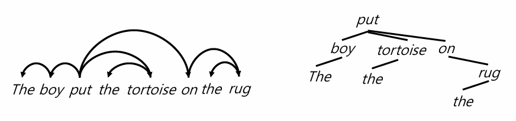

## **1.1. 단어를 세는 것의 어려움**

> They picnicked by the pool, then lay back on the grass and looked at the stars.

문장에 단어가 몇 개 있을까?
이에 대해, 우리는 2가지로 문장 속 단어들을 셀 수 있다.

-   **유형 (Type):** 텍스트에 등장하는 고유한 단어의 종류. 즉, 어휘 사전(Vocabulary)의 크기
-   **사례 (Instance):** 실행 중인 텍스트에서 해당 유형이 등장한 횟수, 대소문자를 다르게 처리할지 결정이 필요함

구두점을 고려하지 않는다면, 14 types와 16 instances로 셀 수 있다.

하지만 고려해야 할 점들이 더 있다.

-   구어의 경우 "uh", "um"과 같은 멈춤(Filled pauses)이나 "main-" 같은 단편(Fragments)과 같은 말더듬(Disfluencies)을 단어로 간주할 것인지 결정해야 할 것이다.
-   I'm과 같은 줄임말도 정서법상 하나의 단어이지만, 문법적으로는 주어 대명사 'I'와 동사 'am'의 줄임말인 'm으로 두 단어이다.
-   중국어, 일본어, 태국어 등 일부 언어는 띄어쓰기를 사용하지 않는다.

## **1.2. 왜 단어를 토큰으로 사용하지 않는가?**

이유는 간단하다. 단어의 양이 매우 많기 때문이다.

**힙스의 법칙(Heaps' Law)**이란 텍스트의 길이가 길어질수록 어휘 사전의 크기도 꾸준히 증가한다는 의미이다.
따라서 아무리 큰 데이터를 사용해도 모델이 모르는 '미등록 단어(Unknown Words)'가 항상 존재하게 된다.

## **1.3. 토큰화 (Tokenization)**

이 문제를 해결하기 위해 현대 NLP에서는 단어를 그대로 사용하지 않고, 더 작은 단위인 **서브워드(Subword)**로 쪼개서 사용한다.
subword에 가장 가꾸은 개념은 형태소(Morpheme)이다.
형태소에는 다음과 같은 것들이 포함된다.

-   자체로 의미를 갖는 형태소
-   굴절 형태소 (Inflectional Morphemes): 단어의 문법적 기능, 과거형 -ed나 복수형 -s
-   파생 형태소 (Derivational Morphemes): 단어의 품사나 의미 변환, -ful이나 -ly

언어마다 단어 하나에 포함된 형태소의 평균 개수는 다르다.
분석어(Analytic)에 가까울수록 하나의 형태소가 단어를 이룰 확률이 높고, 다중종합어(Polysynthetic)에 가까울수록 많은 형태소가 합쳐져 하나의 단어를 이룬다.

문장을 토큰이라는 일관된 단위로 나누는 과정을 **토큰화(Tokenization)**이라고 한다.
토큰화는 시스템 간의 비교를 용이하게 하고, 미등록 단어 문제를 해결하기 위해서 필요하다.

토큰화를 하는 방식은 다음과 같다.

### **1.3.1. 공백 기반 토큰화 (Space-based Tokenization)**

가장 간단한 방법으로, 영어처럼 띄어쓰기를 사용하는 언어에서 **공백을 기준**으로 문장을 나누는 방식이다.

### **1.3.2. 규칙 기반 토큰화 (Rule-based Tokenization)**

단순히 공백만으로는 부족한 경우가 많아, 특정 규칙을 정해 토큰화를 수행하는 방식이다.
하지만 다음과 같은 상황에서 문제가 발생할 수 있다.

-   **문장 부호 처리:** Ph.D., AT&T처럼 점(.)이나 특수기호가 단어의 일부인 경우
-   **특정 형식 유지:** 가격($45.55), 날짜(01/02/06), URL, 이메일 주소처럼 형식을 유지해야 하는 경우
-   **다중 단어 표현 (MWE):** New York, rock 'n' roll처럼 여러 단어가 합쳐져 하나의 의미를 이루는 경우

### **1.3.3. 펜 트리뱅크 토큰화 (Penn Treebank Tokenization)**

NLP의 표준 규칙 기반 토큰화 방식 중 하나이다.
주요 규칙은 다음과 같다.

-   **축약어 분리:** don't는 do와 n't로, they'll은 they와 'll로 분리
-   **문장 부호 분리:** word,는 word와 , 두 개로 분리
-   **하이픈 처리:** state-of-the-art처럼 하이픈으로 연결된 단어는 하나의 토큰으로 유지

## **1.4. 서브워드 토큰화**

토큰화에는 다음과 같은 문제점이 발생한다.

-   공백으로 단어를 나누는 방식은 띄어쓰기가 없는 언어에 적용하기 어려움
-   단어의 종류는 계속 늘어나므로 '미등록 단어' 문제가 항상 발생함
-   글자(character) 단위로 쪼개면 의미가 너무 잘게 나뉨
-   형태소는 언어학적으로 정의하기가 매우 어려움

따라서 NLP에서는 데이터 자체를 이용해 토큰화 규칙을 학습하는 방식을 사용한다.
대표적인 알고리즘으로는 **BPE(Byte-Pair Encoding)**와 **Unigram Language Modeling**이 있다.

### **1.4.1 BPE**

BPE는 가장 자주 나오는 글자 쌍을 합쳐서 하나의 새로운 글자(토큰)로 만드는 알고리즘이고, 다음의 두 단계로 나뉜다.

-   **토큰 학습기 (Token Learner):** 텍스트를 가지고 어떤 서브워드를 만들지 학습하여 어휘 사전(Vocabulary)을 만듦
-   **토큰 분절기 (Token Segmenter):** 학습된 어휘 사전을 바탕으로 새로운 문장을 토큰으로 나눔

알고리즘의 pseudo code는 다음과 같다.

1.  모든 단어를 글자(character) 단위로 쪼갠다.
2.  텍스트에서 가장 자주 등장하는 인접한 글자 쌍을 찾아 하나로 합친다.
3.  이 과정을 정해진 횟수만큼 반복하여 최종적인 서브워드 사전을 만든다.

예시를 들어 이해해보자.

> set␣new␣new␣renew␣reset␣renew

초기 상태는 다음과 같다.

-   **1단계:** 가장 자주 등장하는 글자 쌍은 n과 e이다 (new에 2번, renew에 2번, 총 4번). 이 둘을 합쳐 ne라는 새로운 토큰을 만들고 사전에 추가한다.
-   **2단계:** 가장 자주 등장하는 글자 쌍은 ne와 w이다 (총 4번). 이 둘을 합쳐 new라는 토큰을 만든다.
-   **3단계:** 다음으로 자주 나오는 \_와 r (총 3번)을 합쳐 \_r을 만들고, 다음 r과 e(총 3번)를 합쳐 re를 만든다. 이 과정을 통해 re-라는 의미 있는 접두사를 학습한다.
-   이 과정을 정해진 횟수만큼 반복하면 어휘 사전에는 \[\_new\], \[\_renew\], \[set\] 등 의미 있는 단위들이 토큰으로 등록된다.

BPE는 여러 언어가 섞인 데이터를 학습할 수 있지만, 데이터의 대부분이 영어일 경우 다른 언어의 단어들은 불필요하게 잘게 쪼개지는 비효율이 발생할 수 있다.

## **1.5 한국어 자연어 처리**

한국어는 영어와 달리 단어에 조사, 어미 등이 붙어 문법적 기능이 결정되는 교착어이다. (1.3의 morphemes per word에서 Polysynthetic에 가깝다는 뜻)
단순히 띄어쓰기 단위(어절)로 나누는 것만으로는 부족하며, 의미를 가진 최소 단위인 **형태소**로 분해하는 과정이 필수적이다.

형태소 분석기는 다음과 같은 방법론을 통해 개발된다.

-   **사전 기반 분석:** 불규칙 활용 등 가능한 많은 정보를 사전에 저장하는 방식
-   **규칙 기반 분석:** 사전은 최소화하고, 문법 규칙을 통해 변형을 처리하는 방식
-   **딥러닝 기반 분석:** 언어 모델을 학습하여 통계적으로 가장 그럴듯한 분석 결과를 내놓는 방식

하지만 형태소 분석에는 미등록어 문제, 형태론적 중의성 문제가 발생한다.
예를 들어, " 가시는"이라는 어절은 가시(명사) + 는(조사) 또는 가(다)(동사) + 시(선어말어미) + 는(어말어미)으로 해석될 수 있기 때문에 2개의 분석 결과 중 1개를 선택하기 모호하다.

따라서 문장을 토큰화하기 전, 어디서부터 어디까지가 하나의 문장인지 나누는 **문장 분리(Sentence Segmentation)** 과정이 필요하다.
!나 ?는 문장의 끝을 명확히 나타내지만, 마침표 . 는 문장의 끝일 수도 있고 , Dr.나 Inc. 같은 축약어의 일부일 수도 있으며 , 4.3이나 .02% 같은 숫자의 일부일 수도 있다.
이를 해결하기 위해 보통 텍스트를 먼저 토큰화한 뒤, 규칙이나 머신러닝을 이용해 각 마침표가 단어의 일부인지, 문장의 경계인지 분류하는 방식을 사용한다.

## **1.6 Classic Parsing**

과거의 파서들은 문법 규칙이 너무 엄격해서 약간만 복잡한 문장이 나와도 분석에 실패하는 경우가 많았다.(= coverage가 낮다)
또한, 하나의 문장이 여러 구조로 해석될 때 어떤 것이 정답인지 선택할 방법이 없었다.

아래와 같은 문장을 parsing한다고 생각해보자.

> Fed raises interest rates 0.5% in effort to control inflation.

-   품사 모호성: raises는 동사인가 명사인가? interest는 동사인가 명사인가? 문맥 없이는 알 수 없다.
-   구문 구조 모호성 (Syntactic Attachment Ambiguity): 문장의 특정 덩어리가 어디에 연결되는지에 대한 모호하다. 문장에서 " in effort ..."가 '금리를 올리는 것'에 대한 것인지, '0.5%'에 대한 것인지 모호하다.
-   의미 모호성: Fed가 '연방준비제도'인지 '연방 요원'인지, interest가 '이자'인지 '관심'인지 등 단어 자체의 의미가 여러 가지일 수 있다.

문법 규칙을 느슨하게 적용하면 모호성이 생기고, 엄격하게 적용하면 오히려 더 많은 문장을 분석하지 못하는 문제가 발생한다.

이를 해결하기 위해 문법적으로 가능한 모든 구조를 찾되, 그중에서 가장 확률이 높은(가장 그럴듯한) 구조를 선택하는 **통계적 파싱(Statistical Parsing)**을 사용하게 된다.

통계적으로 가장 그럴듯한 구조를 찾으려면 정답 데이터가 필요한데, 이 역할을 하는 것이 바로 **트리뱅크(Treebank)**이다.

트리뱅크는 수많은 문장에 대해 전문가들이 직접 올바른 문법 구조를 표시해 둔 대규모 데이터 모음이다.

이를 통해 문법 구조의 빈도 정보를 얻어 평가 기준이 생겼고, 이 데이터를 통해 파서를 학습할 수 있게 되었다.

## **1.7 문장의 구조**

문장의 구조는 크게 두 가지 방식으로 표현된다.

### **1.7.1 구 구조 (Constituency / Phrase Structure)**

단어들을 구(Phrase)라는 더 큰 덩어리로 묶어가는 계층적인 방식이다.
예를 들어, Fed는 명사구(NP), raises interest rates는 동사구(VP)로 묶인다.

### **1.7.2 의존 구조 (Dependency Structure)**

단어들 간의 **수식 또는 의존 관계**를 화살표로 나타내는 방식이다.
출발점은 동사로, 그 외 모든 요소(주어, 부사 등)는 동사에 의존적이다.

### **1.7.3 구 구조 분석 - 구문 구조 모호성**

자연어는 규칙을 기반으로 설명하기 어렵기 때문에 다양한 구조로 분석하려 노력하지만, 여전히 모호함이 발생한다.

아래의 문장을 구 구조로 분석해보자.

> I saw the man with a telescope.

다음과 같은 2가지 결과가 나올 수 있다.

왼쪽 이미지와 같이 분석한다면 "나는 망원경을 든 남자를 보았다"라고 해석할 것이고, 오른쪽 이미지와 같이 분석한다면 "나는 망원경으로 남자를 보았다"라고 해석하는 **구문 구조 모호성(Attachment Ambiguity)이 발생**한다.

이러한 모호성을 해결하기 위해 Right Association (가까운 단어 결합), Minimal Attachment (가장 간단한 문법 구조로 결합)과 같은 규칙을 정의하려 노력했다. 하지만 모호성을 해결하기 위해서는 단순히 구조뿐만 아니라 단어의 의미나 문맥 등 더 복잡한 정보가 필요하다.

## **1.8 파싱(Parsing)**

**파싱(Parsing)**이란 주어진 문장이 어떤 문법 구조를 가지고 있는지 알아내기 위해, **문법 규칙을 거꾸로 적용해보는 과정**이다.
이는 문법적으로 가능한 수많은 구조 중에서 올바른 구조를 찾아내는 일종의 탐색 문제와 같다.
규칙에 맞게 문장을 만드는 것이 순방향이라면, 만들어진 문장에 적용된 규칙을 찾아내는 역방향이 파싱이다.

### **1.8.1 문맥 자유 문법(Context-Free Grammar, CFG)**

문맥 자유 문법은 G = (T, N, S, R)로 표현할 수 있다.

-   **T(Terminal):** dictionary, 혹은 token들의 모임
-   **N(Non-terminals)**: noun, berb phrase등 문법적인 덩어리, preterminals
-   **S(Start)**: 시작 지점, non-terminals 중 하나
-   **R(Rule)**: non-terminals를 다른 기호들의 조합으로 바꾸는 규칙

Grammar G로 language L을 생성한다.

### **1.8.2 확률 문맥 자유 문법 (Probabilistic CFG, PCFG)**

CFG 규칙만으로는 하나의 문장이 여러 개의 타당한 구조로 분석되는 모호성 문제가 해결되지 않는다.

PCFG는 G = (T, N, S, R, P)로 표현된다.
나머지 요소는 CFG와 동일하되, P(Probability)로 각 문법 규칙에 확률을 부여한다.
파서는 가능한 모든 문장 구조를 만든 뒤 각 구조의 확률을 계산하여 가장 확률이 높은(그럴듯한) 구조를 최종 결과로 선택한다.

### **1.8.3 파서의 품질**

좋은 파서가 갖추어야 할 세 가지 속성은 다음과 같다.

-   정확성 (Soundness): 파서가 내놓는 모든 결과가 문법적으로 유효하고 올바른 구조이다.
-   종료성 (Termination): 파서가 무한 루프에 빠지지 않고 반드시 작업을 끝낸다.
-   완전성 (Completeness): 파서가 정확하고, 종료되며, 주어진 문장에 대해 가능한 모든 유효한 구조를 찾아낸다.

실제로는 완전성보다 효율성을 위해 '정확하지만 불완전한 파서(k-best list)'를 사용하는 경우가 많다.

## **1.9 파싱 알고리즘**

문법 규칙을 적용해 문장 구조를 탐색하는 방식에는 크게 두 가지가 있다.

### **1.9.1 하향식 파싱 (Top-down Parsing)**

'문장(S)'이라는 가장 큰 목표에서 시작해 문법 규칙을 적용해 점점 더 작은 단위로 확장하면서 실제 문장의 단어들과 맞춰본다.

non-terminal에서 terminal로 갈 때 branh factor(분기 개수)이 많아지기 때문에 이 경우 top-down보다 실제 문장에 있는 단어(terminal)에서 시작해 이 단어가 어떤 품사(non-terminal)가 될 수 있는지 역으로 찾아가는 bottom-up 방식을 적용하는 것이 효율적이다.

### **1.9.2 상향식 파싱 (Bottom-up Parsing)**

실제 문장을 구성하는 단어들에서 시작한다.

단어들을 묶어 작은 구를 만들고, 이 구들을 다시 묶어 더 큰 구를 만드는 식으로 규칙을 거꾸로 적용하며 최종적으로 '문장(S)'을 완성한다.

문장의 일부만 봤을 때는 문법적으로 맞는 것 같지만, 전체적으로는 불가능한 구조를 만드는 쓸데없는 작업을 할 수 있다.